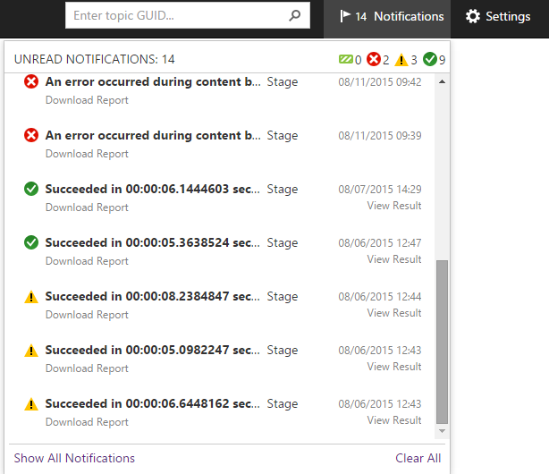
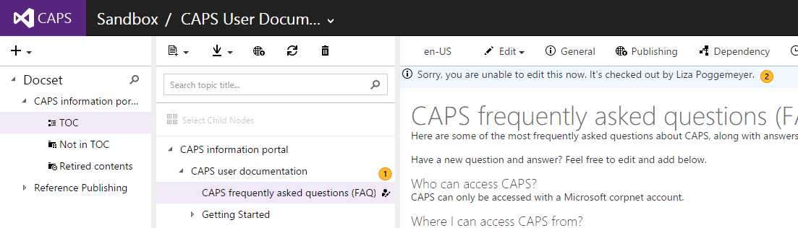

# CAPS Client
**In this topic:**

* [Notification Center](#NotificationCenter)
* [Display topic checked out status in CAPS client](#DisplayCheckoutTopics)
* [Control layout rearranges based on screen resolution or window size](#LayoutOnScreenResolution)
* [Sorting assets in Not in TOC, Retired contents, and Trash folders](#SortingAssets)

##<a name="NotificationCenter">Notification Center</a>##
We have a notification center to keep you infirmed on publishing progress and status, both to MTPS or offline.

It is located between the *Search by topic GUID* box and the **Settings** icon on the top right.

Once the publish is done, it would show a virtual hint indicating that the publishing job is completed. If you click on the notification center, you will see a list of all the notifications of actions taken by you. If you click on the any of the notifications, it will take you to the publish history section. 

On the top, you will see a summary of the total notifications that are unread as well as a summary of how many have succedded, failed, or have warnings.

Although initially the notification center only contains publishing information, it will be expaded to other areas like reflection, localizaiton handoffs, hand backs, et. 

##<a name="DisplayCheckoutTopics">Display topic checked out status in CAPS client</a>##

1. If your topic is checked out, you may see an icon next to the topic indicating so.
2. If the topic is checked out to somebody else, yoiu will also see a message on top of the topic with the name of the person who has the topic checked out.

##<a name="LayoutOnScreenResolution">Control layout rearranges based on screen resolution or window size</a>##
Size of the panels and position of the toolbars will be adjusted based on your screen size, resolution and Internet browser window. 

##<a name="SortingAssets">Sorting assets in Not in TOC, Retired contents, and Trash folders</a>##
Content can be sorted alphabetically (ascending/descending or by updated date most recent/least recent). Just click on the **Sort by** drop down underneath the search box.
