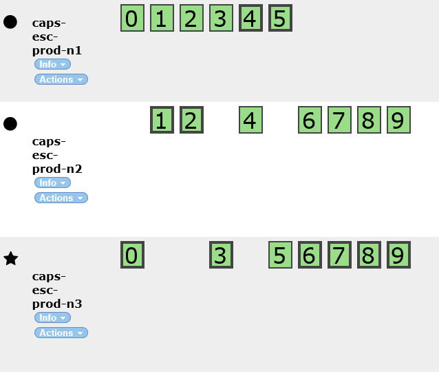

# Content Repository Index Service Heartbeat Failure TSG
Steps when receive CR index heartbeat failure.
1.	Check index cluster health status. Open url below (ask CR team to provide user name and password)
http://caps-escluster-prod.cloudapp.net:9200/_plugin/head/
If the status is green like below, could be a false alert.

2.	If the health status is yellow or red, check the missing node of cluster. Normally, prod cluster should have 3 nodes. If some node missing, for example “caps-esc-prod-n3”, go to next step.

3.	Open Azure portal, choose “Caps ContentRepository Backend” subscription
	- -> Choose cloud service “caps-escluster-prod”
	- -> Click “INSTANCES” tab and remote to the missing node, for example “caps-esc-prod-n3” VM.
4.	If the VM is not on running status, reboot it directly. If yes, go to step 5,
5.	Remote to the problematic VM (ask CR team provide user and password), open service and
	- Create mini dump file of service “elasticsearch-service-x64”.
	- Reboot the problematic VM from azure portal.
	- Check service “elasticsearch-service-x64” is running after reboot. If not running, manually start the service.
	- Open the url http://caps-escluster-prod.cloudapp.net:9200/_plugin/head/ again and check health status is green.
6.	If problem still exists, call CR live site engineer. 
7.	In IcM, find team “Visual Studio China/ CAPS Content Repository”, find the [on-call list](https://icm.ad.msft.net/imp/CurrentOnCall.aspx?teamId=23147&tenantId=20342&incdep=0&incvirt=1&mode=oneshift) and call the one who is on call.  
