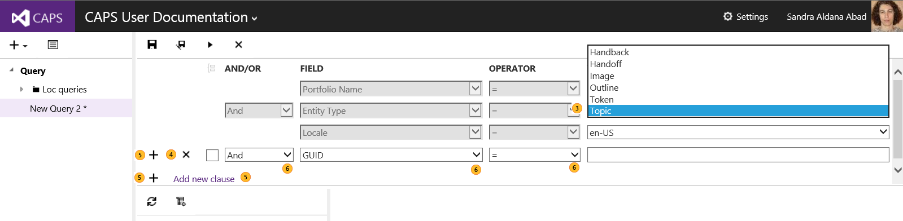
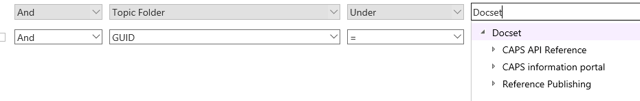
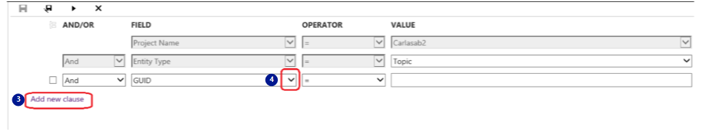
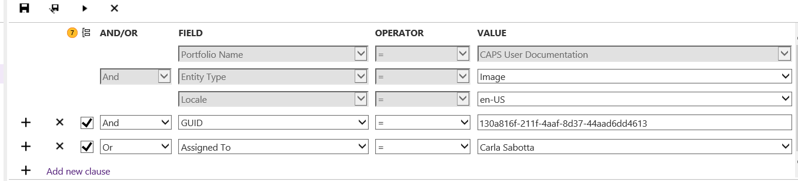
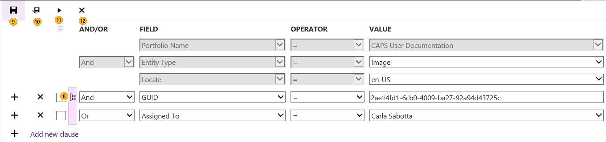
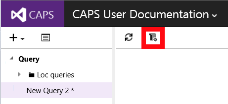
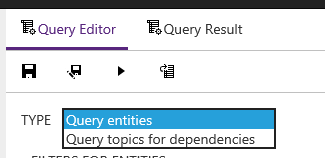
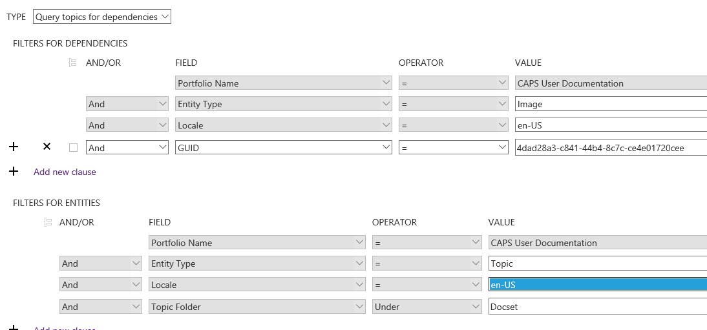
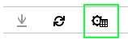

# Creating, Updating, and Managing Advanced Queries
Advanced query lets you set complex query criteria. You can also save your query and reuse it later.

**In this topic**

-   [Team queries](#TeamQuery)

-   [Creating and running a query](#CreateRunQuery)

-   [Types of queries](#QueryTypes)

-   [Understanding the query operators](#QueryOperators)

-   [Choosing desired columns for query results](#ColumnPickerQuery)

-   [Sorting results in query output](#ShortQueryResults)

-   [Exporting a query](#ExportingQuery)

-   [Exporting the query results](#ExportQueryResults)

-   [Renaming a query](#RenamingQuery)

-   [Deleting a query](#DeletingQuery)

## Team queries
Team queries are shared among all the team members that have access to the portfolio. If you create a query, any other user who has access to your portfolio can see it and, if they have write access, they might be able to modify it.

## Creating and running a query

|||
|-|-|
||In the upper left-hand area of the CAPS window, click the **New Query** icon.|
||The query editor appears in the CAPS window.|

By default, clauses for  **Entity Type**,  **Locale**, **Topic Folder** (not shown above -- it's an old screen shot -- see "Scope by topic folder in the table below"), and  **GUID** are added to the query. **Entity Type**, **Locale**, and **Topic Folder** are mandatory and cannot be removed.

|||
|-|-|
||Select a value for **Entity Type**:  -   Topic -   Image -   Token -   Handoff -   Hand back|
||Scope by topic folder:  1.  Click in the Value field for the Topic Folder clause. 2.  Choose the path to scope your query under. The default, Docset, will return results for all docsets in the portfolio. You can drill down to any node in any docset.  |
||To remove a clause, click on the **X** icon.|
||To add another clause, click **Add new clause** or one of the **+** icons.|
||To change the **AND/OR** logical operators, the **Field**, **Operator**, and field **Value** for an existing clause, click the down arrow next to the drop-down box.  |

|||
|-|-|
||To group two or more clauses, click the box next to each clause and then click the **Group selected clauses** icon.  |

|||
|-|-|
||To ungroup clauses, click the **Ungroup selected clauses** icon.|
||Once you've completed the query, click the **Save Query** icon. A dialog pops up to name the query and select whether to save it as a private or shared query.|
||To change the name of an existing query, click the **Save query as** icon, or right-click the query name and select **Rename**.|
||Run the query by clicking the **Run query** icon.|
||To close the query clauses click on the **X** icon.  To show the query clause again, click on the **Edit query** icon. |

## Types of queries
There are two types of queries in CAPS: entity queries and dependency queries.

Entity queries return the entities (topics, tokens, images, handoffs, or handbacks, depending on the Entity Type selected) that match the query criteria. New queries are entity queries by default.

Dependency queries allow you to find which topics take a dependency on an entity. See **Finding Dependencies** in [Query Techniques and Examples](../Topic/Query-Techniques-and-Examples.md) .

## Understanding the query operators

|||
|-|-|
|=|Use for *&#42;&#42;full-text search&#42;&#42;*.  Used to find an exact match of the **Field** of the entity type you are looking for.|
|&lt;&gt;|Use for *&#42;&#42;full-text search&#42;&#42;*.|
|||
|Contains|Use for *&#42;&#42;full-text search&#42;&#42;* (for string fields).  It’s only used for full words and it does not admit any wildcards.|
|Does Not Contain|Use for *&#42;&#42;full-text search&#42;&#42;* (for string fields).|
|Begins With|Use for *&#42;&#42;partial-text search&#42;&#42;* (for string fields).  It matches a text field with prefix.  So if your query is search for all topics where *Name STARTSWITH “What”*, it will return you topics with title “What’s New”, “What Is Azure”, etc.|
|Wildcard|Use for *&#42;&#42;partial-text search&#42;&#42;* (for string fields).  It accepts two special characters:  1.  ? 2.  &#42;  ‘?’ matches any single character while ‘&#42;’ matches any number (including zero) characters. So if your query is search for all topics that contain the string "Azu" then you need to look for *Name WILDCARD “&#42;Message&#42;”*a nd CAPS will return topics with title “What is New in Message Analyzer”, “Capturing Message Data”, etc.  If you use *Name WILDCARD “Message&#42;”* CAPS will only return those topics which name starts with "Messge"  If you use  *Name WILDCARD “Message?”* CAPS will only return those topics like "Message" or "Messages"|
|Under|Use to indicate the location of the asset: under a certain docet, TOC folder, folder, etc.|
|Exists|Use for fields that have some predefined values, like users, locales, etc.|
|&gt;=|Use for date or numeric fields.  Searches for fields which value is bigger or equal than the specified value.|
|&gt;|Use for date or numeric fields.  Searches for fields which value is bigger than the specified value.|
|&lt;=|Use for date or numeric fields.  Searches for fields which value is smaller or equal than the specified value.|
|&lt;|Use for date or numeric fields.  Searches for fields which value is smaller than the specified value.|

## Choosing desired columns for query results
By default, the results are presented in a list format via the **Query Editor**.

You will see the results now in a table with different columns. You can remove, add or change the order of the columns by clicking on the **Column Options**button .

## Sorting results in query output
Click on the header of any column to sort the query results by that column.  Clicking on it once, will sort the results in descending order. Clicking on it again, will sort the results in ascending order. An arrow appears if you click on the header of the column to indicate the sorting.

## Exporting a query
You can export a query as a JSON file to be consumed by another tool or process. For example, Loc and PubDesk tools use these extensively.

To export a query:
1. In the Query Editor, click this icon:

2. The query will download as a JSON file.

## Exporting the query results

1.  Make sure you are viewing the results in a table view, by selecting **Query Results**.

2.  Click on the **Download to Excel** button.

3.  CAPS will give you a link to download the Excel results.

> [!IMPORTANT]
> In Chrome, you might not see the Excel file getting downloaded. Please go to the address bar right side, and click on the popup blocker. Either download the file from there or always allow popups to be downloaded for CAPS site.

## Renaming a query
1. Right-click the query  and select Rename.
2. Type in the name.
3. Hit enter to save the change.

## Deleting a query
1. Right-click the query and select Delete.
2. Click Yes to confirm.
