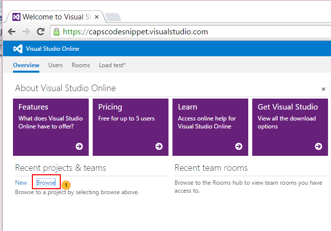
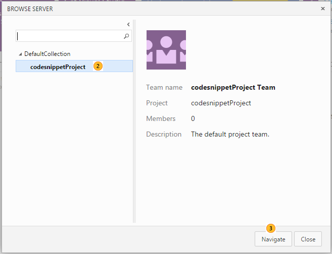
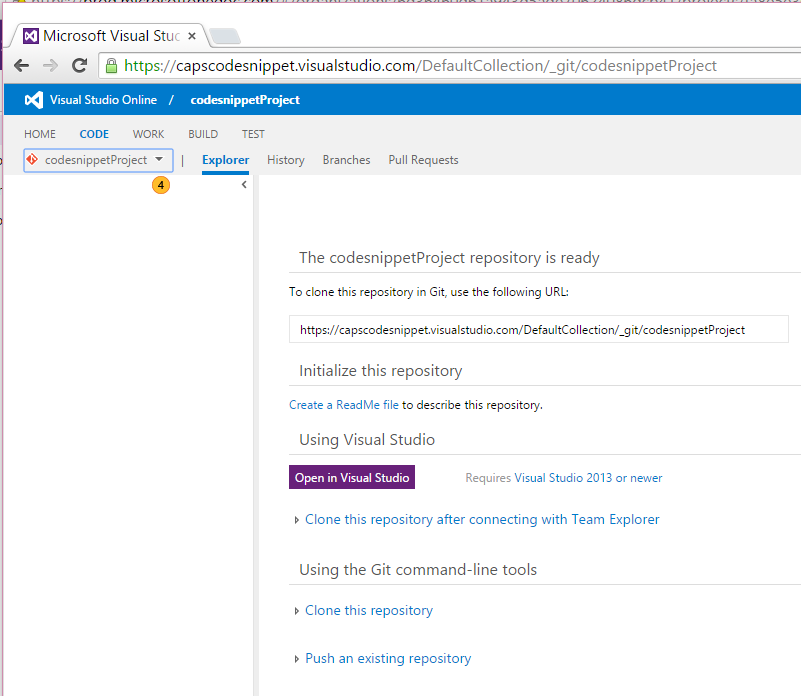
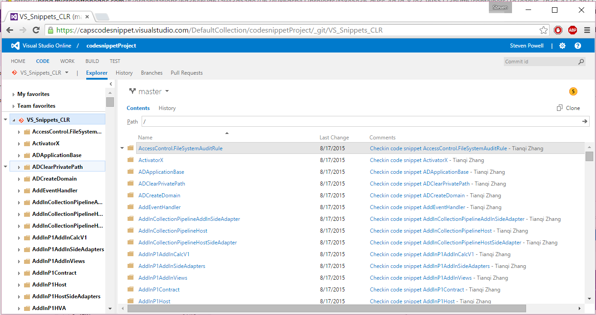
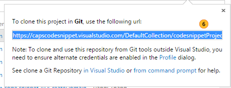
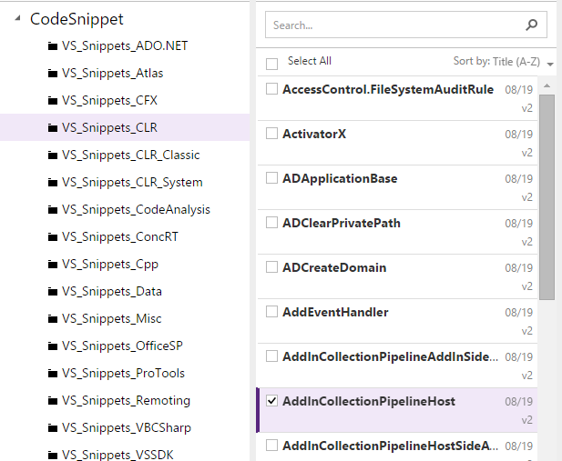
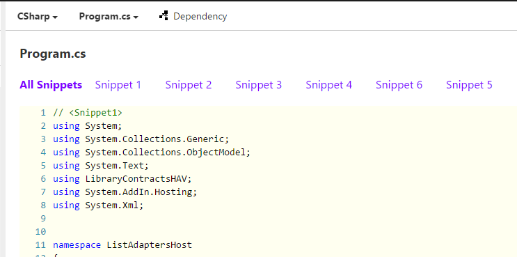
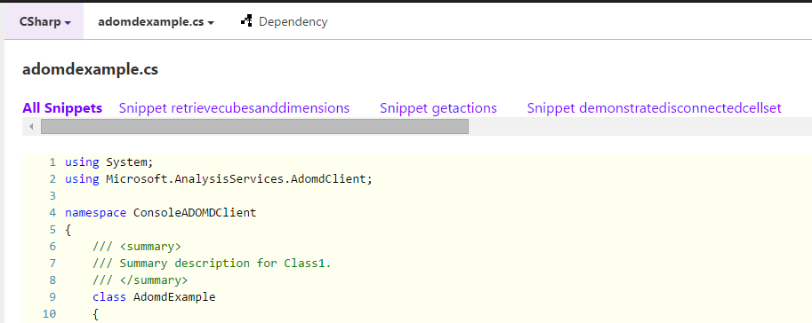

# Creating, updating, and referencing external code snippets (VSO Git)
You can reference code snippets stored in Visual Studio Team Services Git from within your CAPS topics. The advantage of doing so is that you can create an end-to-end code sample that contains multiple snippets, using them in as many topics as you want, and still modify the code in a single place. In addition, by using VSTS Git for code snippets,  VSTS can potentially be used to define automated builds or tests for that content (not yet supported).


To work with snippets, you work directly with VSTS Git. We recommend using the command-line Git Bash tools.

> [!NOTE] The approach outlined here is intended for small teams (up to ten people collaborating on the same code snippets). If you have a large team collaborating on code snippets, you likely need a more structured approach, where users do not push changes directly into the master branch, but rather work in their own forks, and then submit pull requests to merge those changes back into the master branch. The more advanced scenario is not covered in this topic. 

## In this topic

[What do I need?](#WhatDoINeed)
[Where do I put my snippets?](#Where)
[How do I set up my VSTS Git repo?](#setupRepo)
[How do I organize my code to support code snippets?](#Organize)
[What programming languages are supported?](#Supported-programming-languages-and-folder-names)
[What is the syntax for delineating snippets?](#snippetStructure)
[How do I add my project to Git?](#AddToGit)
[How do I add or update snippets in my project?](#AddUpdate)
[How do I find code snippets in CAPS?](#Find)
[How do I reference snippets from my CAPS topics?](#referenceSnippets)
[FAQ](#FAQ)

## <a name="WhatDoINeed"></a>What do I need? 

You need three things to use external code snippets in your content:
- Access to CAPS
- Access to a Visual Studio Team Services project that contains the source code files with your code snippets (see below)
- [GitBash](http://git-scm.com/downloads), a tool to run Git commands

## <a name="Where"></a>Where do I put my snippets?

Each CAPS Portfolio can be associated with one or more VSO Git projects (also known as repos). Contact your CAPS Portfolio Administrator for information about which repos are associated with your Portfolio OR associate a repo with your CAPS portfolio.

Your CAPS Portfolio administrator can grant access to a Security Group as long as it has a mail associated with it.

## <a name="setupRepo"></a>How do I set up my VSTS Git repo?
Before you can work with code snippets, you must connect to the VSO Git repo and clone it to your local computer.

### To get set up to work with snippets

1.  Join the **capscodesnipsg** security group at [IDWeb](http://idweb).

2.  Contact Megan Bradley (mbradley) to request her to add you to the **capscodesnippet.visualstudio.com** VSO project.

3.  Access the VSO Git repo home page ([https://capscodesnippet.visualstudio.com](https://capscodesnippet.visualstudio.com)) and click the **Browse** link.

    

4.  Click **codeSnippetProject** and then click **Navigate** to choose the team project that you want to work with.

    

5.  Select CODE, and then, in the drop-down list, click the team project that you want to clone.

    

6.  You see the folders contained within the team project. In the upper right, click **Clone** to make a local copy of the repo (the entire team project).

    

7.  In the dialog that appears, copy the URL of the team project that you want to clone. You will later clone it using the command prompt.

    

8.  Install Git Bash from [http://www.git-scm.com/downloads](http://www.git-scm.com/downloads) - on this page choose “Windows” and choose the 32-bit or 64-bit version.
9. Follow the instructions on [https://msdn.microsoft.com/library/vs/alm/code/git/command-prompt](https://msdn.microsoft.com/library/vs/alm/code/git/command-prompt)  in the section **Create a personal access token for your Visual Studio Team Services account**, except don’t do the clone yet. Copy the private key into notepad.
10. Set up GCMW (Git Credential Manager for Windows) from [https://github.com/Microsoft/Git-Credential-Manager-for-Windows](https://github.com/Microsoft/Git-Credential-Manager-for-Windows) – click the latest install link, download the .exe, and run it to install.
11. Select the code snippet project that you are interested in (for example, VS_Snippets_CLR), and choose the “Clone” link.
12. Choose to copy the URL for the repo to the clipboard.
13.	Start git bash command prompt. 
14.	Enter the command: git clone https://capscodesnippet.visualstudio.com/DefaultCollection/codesnippetProject/_git/VS_Snippets_ConcRT (use the URL you copied to the clipboard).
15. With GCMW installed correctly, you should not now be asked for credentials.  Without it installed, enter your username and the private key from step 2 as the password.


## <a name="Organize"></a>How do I organize my code to support code snippets?

* Each set of related snippets should be contained within a snippet project.
* Each snippet project contains a sub-folder for each programming language.
* If you want to build your code snippets, include a project file, e.g. .vsproj, .vbproj, .fsproj, .vsxproj, etc.
* You can have snippet code files without a project file, but setting up automated builds for those snippets will be more difficult.


### Example project structure
```
Folder\
    Asynchronous_File_IO_Async\
        cs\
            example1.cs
            example2.cs
            example.csproj
        vb\
            example1.vb
            example.vb
```
## Supported programming languages and folder names

Programming language  |Repo folder name(s)  |File extension(s)
---------|---------|----
Visual C#     | cs (recommended), CSharp (supported)      |.cs, .aspx, .asax, .ascx     |
C++     | Cpp |.cpp, .h, .c, .rc, .idl, .cc, .hpp, .hxx, .cxx |    
Visual Basic     | vb (recommended), VisualBasic (supported)   |.vb, .aspx, .asax, .ascx |              
F#     | FS               ||
JavaScript     | JS      ||
SQL   | tsql| .sql       |
HTML | HTM || 
XML | XML |.xml </br>.xsd and .xsl requested (see bug #24288) </br>.aspx requested (#23583) |
CSDL|||
EDMX|||
JavaScript| | .js|
VBS||.vbs|
Bat||.bat|
Java||.java|
F#|fsharp|.fs, .fsi, .fsw|
XAML||.xaml

## <a name="AddToGit"></a>My snippet project is ready, how do I add it to VSO Git?

### To commit changes to VSO Git

1.  Open Git Bash.

2.  cd to the folder that contains your local clone of the VSTS Git repo to which you want to commit your changes.

3.  Enter the following commands:

    ```
    git status
    git add .
    git status
    git commit -m "yourCheckinComment"
    git status
    git push origin master
    ```
    What do these commands do?

    -   "git status" - use this command early and often. It informs you which branch you're in, what changes you have that weren't yet added or committed, etc.

    -   "git add ." - this command adds any pending changes to your next commit.

    -   "git commit -m" - this command commits your changes to your local copy of the repo. At this point, the changes are still only on your computer.

        > [!IMPORTANT]
        > Uncommitted changes can end up in unexpected places. It's a good practice to always commit changes to your branch before you change branches. In addition, always use git status to make sure that you're in the branch that you thought you were in, that you are committing only the changes that you expect, and that nothing unexpected is taking place.

    -   "git push origin master" - this command takes your local committed changes and pushes them into the master branch. In other words, you're making your changes visible to everyone else, including the CAPS build proecss.

        A few minutes after you push your changes, the background synchronization process will recognize that you've made changes, and will parse your snippet project and push the updated snippets into the associated CAPS Portfolios.


## <a name="snippetStructure"></a>Syntax? Tell me more...
If you were familiar with the syntax for specifying the beginning and end of a snippet  in "Parsnip", the good news is, you already know how to structure snippet projects for use with CAPS. If you are new to snippets, here are the basics (please post in the CAPSChat Yammer group if you can't find what you need, and we will update this doc):

Within your source code, your snippets are designated by comments in a specific syntax that denotes the start and end of each snippet. Note that snippets can overlap or be nested. The specific syntax varies, depending on the comment syntax for the programming language used in the snippet.

### C# Syntax
```
        //<snippetID>
        // your code snippet goes here
        //</snippetID>
```

### Visual Basic Syntax
```
    '<snippetID>
    ' your code snippet goes here
    '</snippetID>
```

### C++ Syntax
```
    // <snippetID>
    // your code snippet goes here
    // </snippetID>
```

### F# Syntax
```
// <snippetID>
// your code snippet goes here
// </snippetID>
```

### JavaScript Syntax
```
    //<snippetID>
    // your code snippet goes here
    //</snippetID>
```


### What's the syntax for a Snippet ID?
You have two options for your snippet identifiers. All snippet IDs start with the word "snippet", followed by either a positive integer OR a string identifier.  If you have a snippet project with only one or two snippets, then using "snippet1" and "snippet2" is short and convenient.

If, on the other hand, you have many snippets within your project, then giving them more meaningful names might make it easier to work with them. And nothing prevents you from combining the two: "snippetInitializer1", "snippetCleanup17".

## <a name="AddUpdate"></a> How do I add or update snippets in my project?
To add a new snippet or update an existing one, create or edit the appropriate snippet file. You will use special comments to indicate where each snippet begins and ends. 

To save new or updated snippets, just commit your changes and push them into the master branch.

## <a name="Find"></a> How do I find code snippets in CAPS?
After you make changes to a snippet, the CAPS synchronization process will detect the new or updated snippet and import it into CAPS. Snippets have their own category in the left navigation pane, just like docsets, tokens, and images. To view code snippets, click the code snippet icon on the icon bar:


> [!NOTE] If your Portfolio has no associated code snippets, the code snippet icon does not appear.

Your code snippet view shows a list of all repos associated with your Portfolio and if you select a repo, you'll see a list of the snippet projects contained in that repo.



If you select a snippet project, you can see details, including all of the snippets contained within that project. You can switch between snippets by clicking the snippet ID. That ID will either be an integer:



or a string:



You will use the snippet project name (e.g. AddInCollectionPipeLineHost) and the snippet ID (e.g. #1 or #retrievecubesanddimensions) to reference the snippet in your articles.

> [!NOTE] You cannot currently query for code snippets.

## <a name="referenceSnippets"></a>How do I reference snippets from my CAPS topics?
After a code snippet appears in your portfolio, referencing it within a topic is very easy. In DDUEML, use a `<codeReference></codeReference>` tag to add a reference to a code snippet. Within the tag, specify the name of the snippet project, followed by #, followed by the snippet ID. A snippet ID is either an integer or a string, depending on what type of identifier was used in the snippet project.


In Markdown, click the snippet button on the toolbar:


Search for the snippet you want, then click to insert it.

## FAQ

### Q: Do I have to have the same number of snippets in all programming languages?
A: Nope. If a snippet ID doesn't exist in a particular programming language, that reference will show no code.

### Q: Can I use the Visual Studio features that integrate with VSO Git?
A: Yes.

### Q: Can I delete snippets?
A: Not currently. That is, although you can delete source code files from the repo, CAPS doesn’t recognize the deletions. Improved sync between the repos has been requested for Q4 ([Feature 21157](https://capservice.visualstudio.com/DefaultCollection/CAPS/_workitems?_a=edit&id=21157)), but until this is implemented it's recommended that you don't delete anything from your repo.