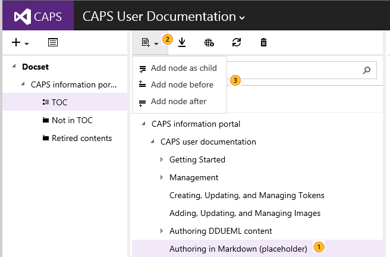
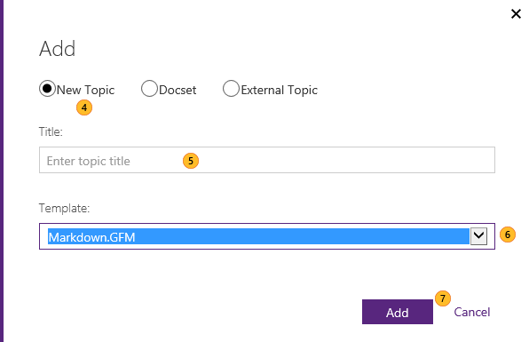
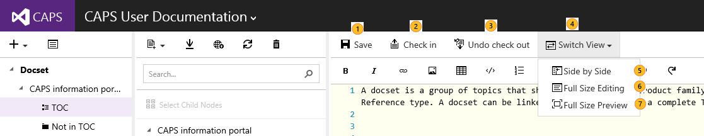
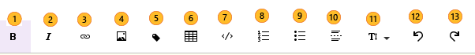
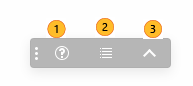
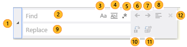

# Creating and updating Markdown topics
You can author in Markdown, using GitHub Flavor (GFM)! This is currently only supported for new conceptual topics that do not required localization.

In this topic

-   [Creating a Markdown topic](#CreatingMDtopic)

-   [Editing a Markdown topic](#EditingMDTopic)

-   [Authoring toolbar](#MDAuthoringToolbar)

-   [Floating help tool bar](#MDFloatingToolbar)

-   [Search and Replace](#MDSearchReplace)

-   [Inserting links in a topic](#MarkdownLinks)


-   [Inserting tokens in a topic](#MarkdownToken)

-   [Inserting videos in a topic](#MarkdownVideo)

-   [Inserting notes, warnings, etc.](#MarkdownNote)

-   [Basic MD validation upon check-in](#MDValidation)

## <a name="CreatingMDtopic"></a>Creating a Markdown topic


|||
|-|-|
||If there are more topics in the docset, select a topic within a docset|
||Click on **Add New**|
||Select the location for the new topic with relation to the selected topic|


|||
|-|-|
||Select **New Topic**|
||Give the topic a name|
||In Template, select GFM.Markdown|
||Click **Add**|

## <a name="EditingMDTopic"></a>Editing a Markdown topic
The new topic provides a readme to help author in Markdown. Replace the readme content with your own.



|||
|-|-|
||You can save a draft version of the topic to the server. Note that CAPS auto saves the topic every time you stop typing for 1 second.|
||When you are ready to check-in your content into CAPS.|
||If you do not want to check-in the content into CAPS.|
||Click on **Switch View** to author the content in different ways. By default, you get the **Normal** view.|
||**Side by Side** shows the editor on the left and the preview on the right. Preview gets updated as you type.|
||**Full Size Editing** shows the editor in full screen|
||**Full Size Preview** shows the preview in full screen. Ideal for topic review!|
You can use the toolbar for inserting elements quickly

You can also use the widget to see an online TOC, help syntax , or go to the top of the page.

## <a name="MDAuthoringToolbar"></a>Authoring toolbar
The authoring toolbar saves you time as it allows you to insert elements quickly, without having to type down the Markdown syntax.



||||
|-|-|-|
||Setting text to bold|Ctrl+B|
||Setting text to italic|Ctrl+I|
||Inserting an internal or external link|Ctrl+Alt+L|
||Inserting an image|Ctrl+Alt+G|
||Inserting a token|Ctrl+Alt+P|
||Inserting a table|Ctrl+Alt+T|
||Inserting code sample|Ctrl+Alt+C|
||Inserting a numbered list|Ctrl+Alt+O|
||Inserting a bulleted list|Ctrl+Alt+U|
||Inserting a horizontal line|Ctrl+Alt+R|
||Insert headers|N/A as you need to choose which header to insert|
||Undo the last action|Ctrl+Z|
||Redo the last action|Ctrl+Y|

## <a name="MDFloatingToolbar"></a>Floating help tool bar
When you are authoring a Markdown topic in CAPS and **not using** the Normal view,  you get a floating toolbar with the following options. You can move the toolbar to any position you would like.



|||
|-|-|
||Markdown syntax help on most-common tasks|
||In-topic Table of contents. You can click on any link to go to that section of the topic|
||Go to the top of the topic|

## <a name="MDSearchReplace"></a>Search and Replace
In order to invoke the Search and replace dialog box, make sure you are in the editing window, otherwise you will bring up the Internet browser search window.

Press Crtl+F.



||||
|-|-|-|
||Click on the arrow to open or close the Replace option|*Not available*|
||Type the text to look for|*Not available*|
||Click this option to enable or disable match case|*Not available*|
||Click this option to enable or disable looking for the full word or not|*Not available*|
||Click this option to enable of disable to use regular expressions in the **Find** text box|*Not available*|
||Go to the previous match|Shift+F3|
||Go to the next match|F3|
||Click this option to search for only the content that is selected|*Not available*|
||Type here the replacement text|*Not available*|
||Click this option to replace the current match|*Not available*|
||Click this option to replace all the matches|*Not available*|
||Closes the Search and Replace dialog|*Not available*|

## <a name="MarkdownLinks"></a>Inserting links in a topic
To insert links to other topics and sites, click the link icon and select internal or external as appropriate.

To  create bookmarks to sections in the current topic or other topic, use link text. Bookmarks are added using this syntax: # &lt;a name="bookmark-name"&gt;Section Header &lt;/a&gt;

H2s (##) are automatically anchors, so you do not need to create bookmarks for them. The syntax for linking to H2s is link text.


## <a name="Inserting%links%to%images%in%a%topic"></a>Inserting images as links
You can insert an image that will be a live link when clicked. The syntax for linked images is:

[](link path)


## <a name="MarkdownToken"></a>Inserting tokens in a topic

1.  Make sure there is a token already created. See.

2.  Edit the topic.

3.  Insert the following: *[!TOKEN (../Token/&lt;tokenName&gt;.xml)]*, where *&lt;tokenName&gt;* is the name of the token.

    > [!TIP]
    > Token  name is case sensitive.

    > [!TIP]
    > If your token name has spaces, replace each  with a "+" sign.

    > [!TIP]
    > Example: *[!TOKEN (../Token/Visual+Studio+Long+Name.xml)]*

## <a name="MarkdownVideo"></a>Inserting videos in a topic
The current design support inserting YouTube video into markdown format by copying &amp; pasting embedded iframe from YouTube.

-   Go to the video in YouTube. For example [YouTube video](https://www.youtube.com/watch?v=iyT1uILEI2U).

-   In the YouTube page, click on **Embed** to get the corresponding iframe code.  In this case it would be *&lt;iframe width="420" height="315" src="https://www.youtube.com/embed/iyT1uILEI2U" frameborder="0" allowfullscreen&gt;&lt;/iframe&gt;*

-   Copy and paste the iframe and insert it directly into your Markdown topic to play the video directly in your content.

## <a name="MDValidation"></a>Basic MD validation upon check-in
We offer basic validation before check-in to ensure your content can publish and render correctly.  We will be adding more robust validation as we provide more support for Markdown in CAPS.

## <a name="MarkdownNote"></a>Inserting notes, warnings, etc.
There are different types of notes. The following is the syntax. The terms NOTE, WARNING, TIP, IMPORTANT and CAUTION, must be in **all capital letters**. In addition, do not indent the > more than three spaces.

The authoring:

```md
  > [!NOTE] Just a note to let you know...
 
  > [!WARNING] Do that again and I'll pout!
 
  > [!TIP] To write examples of markdown in markdown, use a code block (triple back tick).
 
  > [!IMPORTANT] This text is quite grand and notable.
 
  > [!CAUTION] This text is a little timid and is tiptoeing around.
```
Results in:

  > [!NOTE] Just a note to let you know...
  
  > [!WARNING] Do that again and I'll pout!

  > [!TIP] To write examples of markdown in markdown, use a code block (triple back tick).
 
  > [!IMPORTANT] This text is quite grand and notable.
  
  > [!CAUTION] This text is a little timid and is tiptoeing around.

## See also

-   [Managing topics](../Topic/Managing-topics.md)

-   [Grouping assets](../Topic/Grouping-assets.md)

-   [Deleting and Restoring content](../Topic/Deleting-and-Restoring-content.md)

