# Creating and updating images and videos
Images can be used for both DDUEML and Markdown content.

**In this topic**

-   [Adding images to CAPS](#bmkm_addingimagetoCAPS)

-   [Image metadata](#bmkm_imagemetadata)

-   [Replacing an image file with another one](#bmkm_replacingimage)

-   [Renaming images](#bmkm_renamingimage)

-   [Replacing an image file with another one](#bmkm_replacingimage)

-   [Viewing image history](#bmkm_imagehistory)

-   [Downloading an image file](#bmkm_downloadimage)

-   [Valid image extensions](#ImageExtensions)

For information on adding inline video to DDUEML content, see this article in the CSI KB: [Add an Inline Video to a Topic](https://microsoft.sharepoint.com/teams/STBCSI/e/CE/CSI%20DnA%20Knowledge%20Base/Add%20an%20Inline%20Video%20to%20a%20Topic.aspx).

## Adding images to CAPS
Open the CAPS portfolio where you want to add images.

|||
|-|-|
||Click **Image** in the left-hand pane.|
||Click on the **+** sign.|
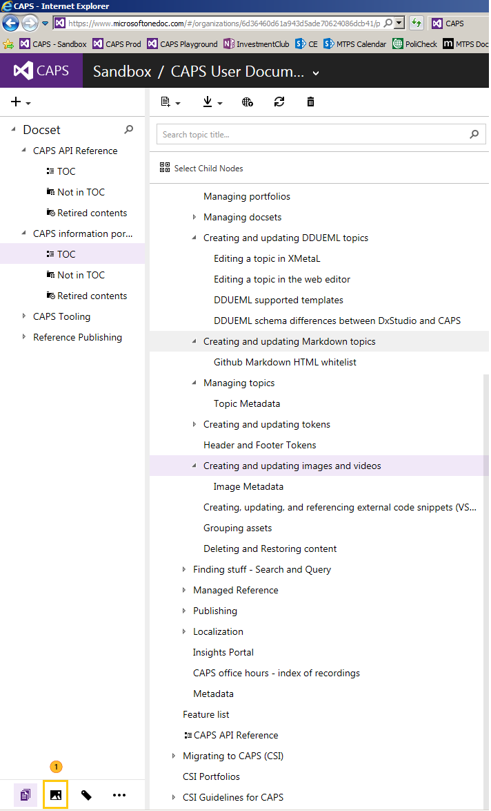

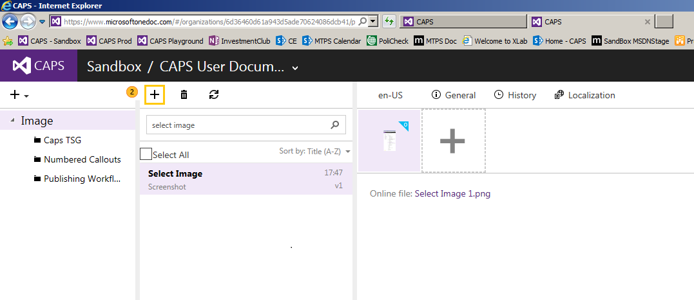

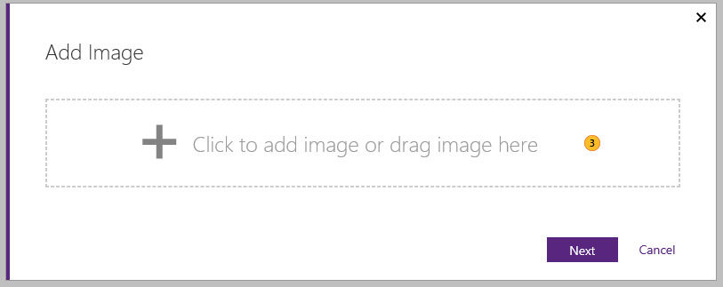

|||
|-|-|
||Click on the box to add images or drag and drop images from Windows Explorer.|
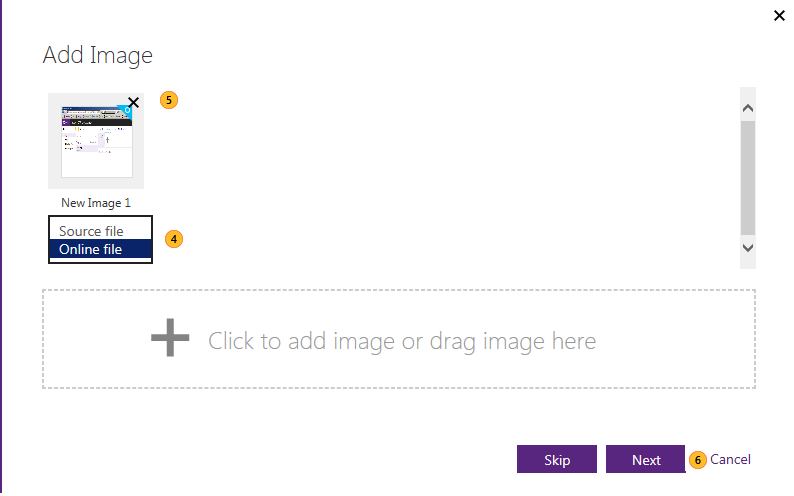

|||
|-|-|
||For each of the files you added, choose whether they are online or source files. **Note:** You can only have one online file. If you already have an  online file and select another file as online, the file marked as online will become a source file. Source files can be any layered file such as PowerPoint, Word, PhotoShop, Adobe Illustrator, Visio, etc.|
||If you would like to remove any image, click on the X icon for the image.|
||Click **Next**|
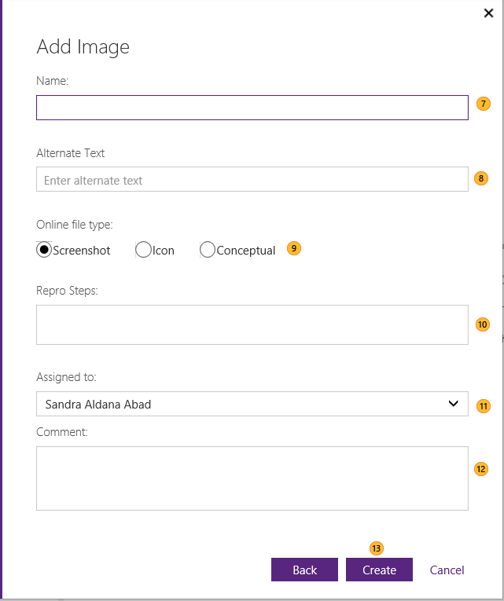

|||
|-|-|
||Enter the image name in the **Name** box. This is a mandatory field.|
||Enter the alternate text for the image in the **Alternate text** box. This is a mandatory field. CAPS UI does limit the ALT text length to 255 characters. MTPS does not have a limitation on the text length.|
||Choose the image type. Alike DxStudio, in CAPS there are only 3 image types:  -   Screenshot -   Icon -   Conceptual|
||If the image is a screen shot, you can add how to reproduce it in the **Repro steps** box.|
||You can assign the image to somebody else, like an artist using the **Assigned to** box.|
||If needed, add any comment for the artist or for yourself in the **Comment** box|
||Click **Create**. The image set gets added to CAPS.|

## Image metadata
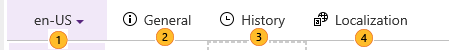

|||
|-|-|
||Use the language drop-down to choose the language version of the image that you want to see. If no localized content is available, only English (en-us) will appear.|
||Use the **General** tab to view and set general metadata, such as title, keywords, tags, status, etc. For a complete list, see [Image Metadata](../Topic/Image-Metadata.md). **Tip:** Remember to click **Save** to persist your changes.|
||Use the History tab to view changes to the topic and its metadata, see [Viewing image history](#bmkm_imagehistory).|
||Use the Localization tab to see and edit the topic's localization metadata, create a handoff, etc. See [Localization](../Topic/Localization.md).|

## Renaming images
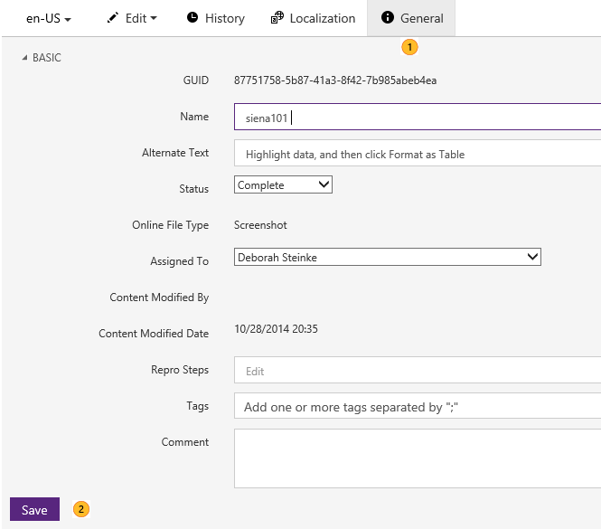

|||
|-|-|
||Use the **General** metadata tab to change image name.|
||Click on **Save** when you are done.|

## Replacing an image file with another one

1.  Select the image.

2.  If the image is the online file, you can click on the icon in the image, and follow the steps to replace the image with a new one.

    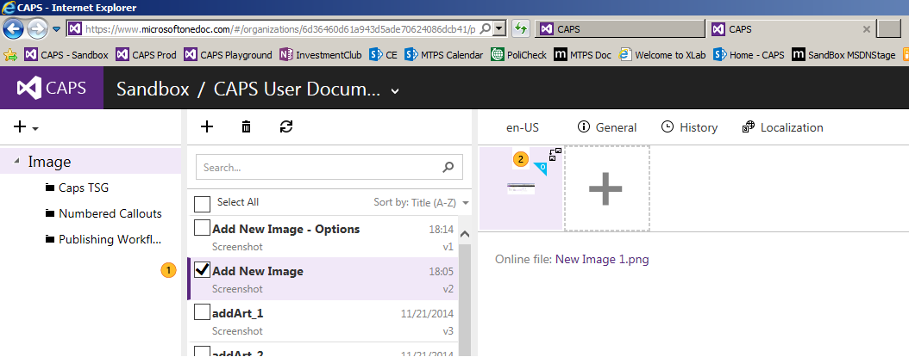

3.  If you would like to replace  one of the source images, remove the image and add a new one. See [Adding images to CAPS](#bmkm_addingimagetoCAPS)

If you are replacing the online image, all the topics that refer to that topic will update that reference automatically. However, you still need to publish the topics if you would like your customers to see the update.

> [!NOTE]
> In future releases, these unchanged topics with updated references will be updated with a dot release. For example, your topic is version 5, and the image for the topic gets updated. That means your topic will be now 5.1. Then, you should be able to query for topics that have updated references, so you can review if the dependencies still apply, update if not or republish if you are ready to do so.

## Viewing image history
You can see changes to topic content or to topic metadata by viewing the history.

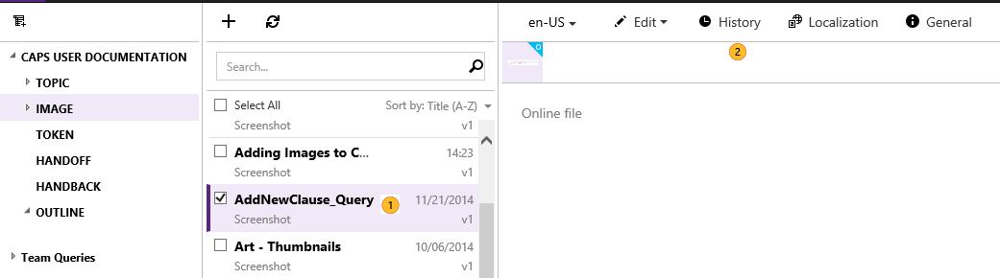

|||
|-|-|
||Highlight the image whose history you want to view|
||Click the **History** tab|
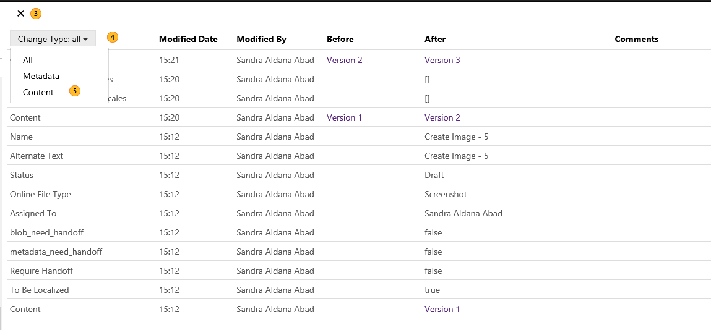

|||
|-|-|
||When you're done, close the tab.|
||You can use **Change Type** to filter the results.|
||Choose **Content** if you want to see only changes to image contents and to compare with the previous version of the image.|
After you filter to show only content, you see:

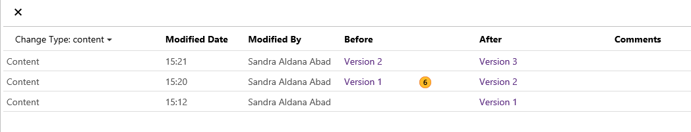

|||
|-|-|
||Click the link for either the previous or current version to see the previous and new version of the image.|

## Downloading an image file

1.  In CAPS, click **Image** in the left-hand pane, and then click an image in the middle pane.

2.  Click the thumbnail image of the file that you want to download.

3.  Underneath the image you will see the file name of the file. Click on it.

4.  In the message box that appears at the bottom of the screen, click **Save As** to save the file to your computer.

    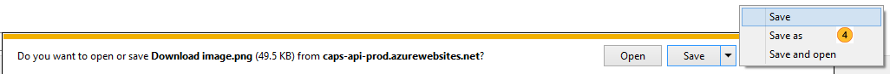

## Valid image extensions
As a  source file, CAPS accepts pretty much any file extension. Make sure that the files are relevant for the image and that they can be localized or used for localization.

As an online file, you can use one of the following extensions:

-   GIF

-   JPEG

-   JPG

-   JFIF

-   PNG

-   BMP

## See also

-   [Grouping assets](../Topic/Grouping-assets.md)

-   [Deleting and Restoring content](../Topic/Deleting-and-Restoring-content.md)

