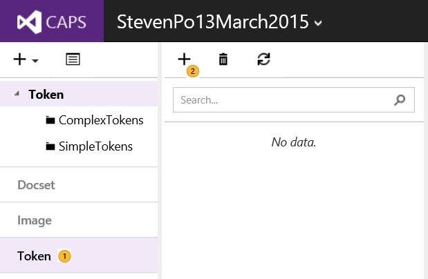
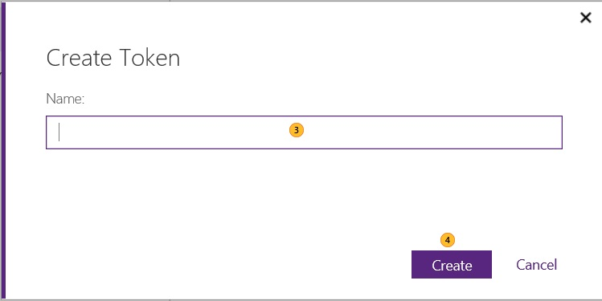
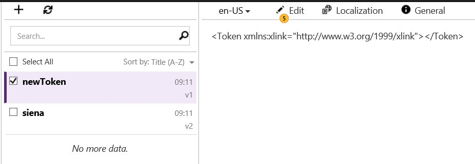
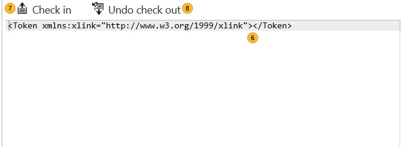
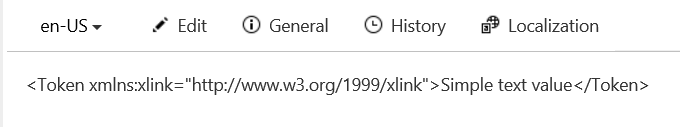
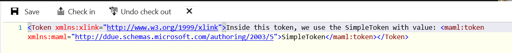
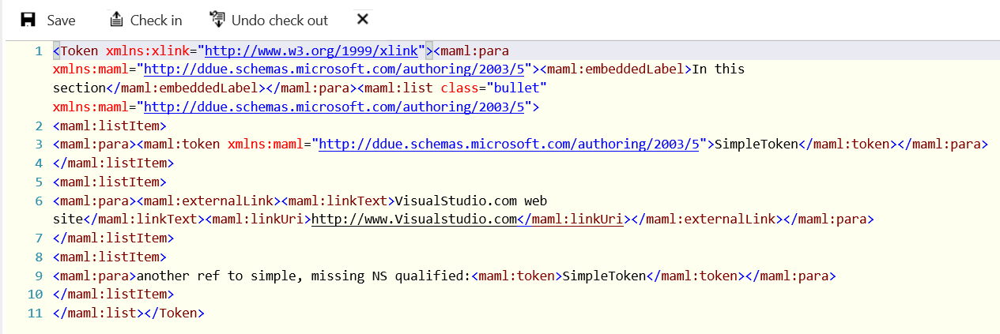

# Creating and updating tokens
Tokens can be used for both DDUEML and Markdown content. Note that if you are using a token with XML or HTML tagging, check-in will fail for Markdown topics.

**In this topic:**

-   [Creating a token](#CreatingToken)

-   [Updating the token definition](#UpateTokenDefinition)

-   [Token definitions for DDUEML](#ExampleTokenDefinitionDDUEML)

-   [Token definitions for Markdown](#ExampleTokenDefinitionMD)

## Creating a token

|||
|-|-|
||Click the **Token** section within your portfolio.|
||Click on the **+** icon to add the token.|

|||
|-|-|
||Give a unique name to the token.|
||Click **Create**.  Next, you'll give the new token a value.|

## Updating the token definition

|||
|-|-|
||Click **Edit**.|

|||
|-|-|
||Give the token a value (see [Token definitions for DDUEML](#ExampleTokenDefinition)or [Token definitions for Markdown](#ExampleTokenDefinitionMD)).|
||**Check in** your changes when done or...|
||**Undo check out** to abandon your changes.|

## Token definitions for DDUEML

|Type|Example|
|--------|-----------|
|Simple (text strings)||
|Nested (be sure to qualify the tag's namespace (e.g. **&lt;maml:token&gt;**)||
|Complex DDUEXML (create the tags in XMetal, then cut and paste into the token definition)||
> [!IMPORTANT]
> Complex DDUEXML tokens, when inserted at the wrong point of your topic, will cause schema validation errors.  Be cautious with complex token usage.

## Token definitions for Markdown
For Markdown, you need to strip out the XML code that comes with the token, i.e., remove *&lt;Token xmlns:xlink="http://www.w3.org/1999/xlink"&gt;&lt;/Token&gt;*. Then, add the token text.

## See also

-   [Grouping assets](../Topic/Grouping-assets.md)

-   [Deleting and Restoring content](../Topic/Deleting-and-Restoring-content.md)

