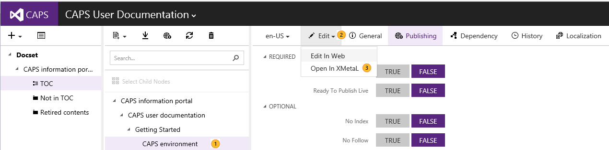
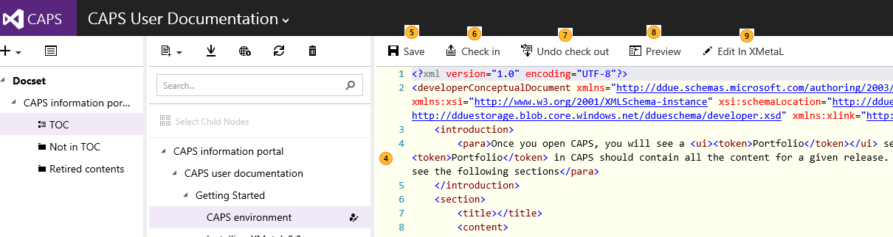

# Editing a topic in the web editor
The web editor becomes handy to do quick edits to the DDUEML file in raw XML format.

## Editing a topic in the web editor

|||
|-|-|
||Select the topic you would like to edit|
||Click on **Edit**.|
||Click on **Edit in Web**.|

|||
|-|-|
||The Monaco web editor opens. Make your changes in the web editor.|
||Click on **Save**, to save a draft to the  server. Note that  CAPS auto saves in the server when you stop typing for 1 second.|
||Once you are done with your changes, you can click on **Check in**. If there is any breaking int he DDUEML schema, you will get an error at this time and you must fix it before you can checkin the topic.|
||If you do not want to make changes, click on **Undo check out** so CAPS reverts to the last checked-in copy of the topic.|
||You can see how your content looks like (including the draft changes).|
||If you have to do more complex editing, you can open the topic in XMetaL. XMetaL will open the latest copy saved on the server.|
