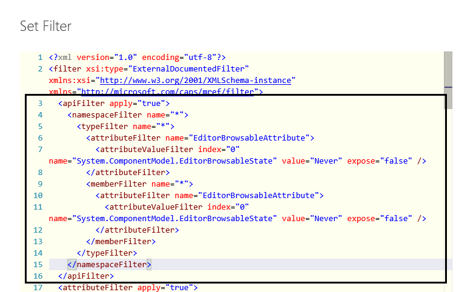

# Excluding APIs (Ripping)
"Ripping" refers to excluding APIs from the managed reference doc even though they are defined as public in the DLL.

Excluding APIs can have both legal and customer impact. If your product is a high-volume project (HVP), you must consult with LCA before excluding APIs to ensure that you are not creating a compliance violation. And you should always consider the customer before excluding APIs: Will devs be able to use the product effectively without this documentation?

If the APIs have no customer value and compliance does not apply, you can exclude them in the following ways.

#### EditorBrowsable(Never)
The recommended way is to add [EditorBrowsable(Never)](https://msdn.microsoft.com/library/system.componentmodel.editorbrowsableattribute%28v=vs.110%29.aspx) in source code. This specifies that the API should not show up in IntelliSense. By default, CAPS excludes APIs with this attribute from reflection. This allows the product team to control the customer experience, and ensures a consistent experience between what you see in the IDE and what is documented.

#### CAPS Filter file
If EditorBrowsable(Never) cannot be used (for example, if code is frozen) but you still need to exclude APIs, you can use the CAPS Filter file, available on the Reflection tab. The default filter file used for all reflection includes various elements that should not be edited unless you know what you're doing. To exclude APIs, customize the **apiFilter** section near the top of the Filter file, as follows, then run reflection and retire removed APIs  if necessary.



>[!NOTE] Be sure to add your elements in the **apiFilter**, not the **attributeFilter**, which comes further down in the default file and also contains **namespaceFilter** and **typeFilter** elements.
  
##### To exclude an entire namespace, add (case-sensitive): 
 
```
    <namespaceFilter name="Namespace.Example">
      <typeFilter name="*" expose="false" />
    </namespaceFilter>
```

For example:

```
	  <namespaceFilter name="System.ComponentModel">
		  <typeFilter name="*" expose="false" />
	  </namespaceFilter>

```

##### To exclude most of a namespace with some exceptions, add (case-sensitive):

```
	  <namespaceFilter name="Namespace.Example">
        <typeFilter name="TypeExample1" expose="true" />
        <typeFilter name="TypeExample2" expose="true" />
        <typeFilter name="*" expose="false" />
	  </namespaceFilter>
    
```

For example:

```
	  <namespaceFilter name="System.ComponentModel">
        <typeFilter name="BindableAttribute" expose="true" />
        <typeFilter name="BrowsableAttribute" expose="true" />
        <typeFilter name="*" expose="false" />
	  </namespaceFilter>
```
##### To expose most of a namespace but exclude some types, add (case-sensitive):

```
	  <namespaceFilter name="Namespace.Example">
        <typeFilter name="TypeExample1" expose="false" />
        <typeFilter name="TypeExample2" expose="false" />
        <typeFilter name="*" expose="true" />
	  </namespaceFilter>

```

##### To exclude some members from an exposed type, add (case-sensitive):

```
<namespaceFilter name="Namespace.Example">
      <typeFilter name="TypeExample1" expose="true" />
          <memberFilter name="MemberExample1" expose="false" />
          <memberFilter name="MemberExample2" expose="false" />
          <memberFilter name="*" expose="true" />
      </namespaceFilter>
```

For example:

```
<namespaceFilter name="Microsoft.Azure.Documents">
      <typeFilter name="DatabaseAccount" expose="true">
			<memberFilter name="CapacityUnitsConsumed" expose="false"/>
			<memberFilter name="ReservedDocumentStorageInMB" expose="false"/>
			<memberFilter name="*" expose="true"/>
		</typeFilter>
</namespaceFilter>
```
And so on.

When you run reflection, the APIs will not be included.

### Retiring MRef topics

If you add APIs to the Filter file of an existing mref docset, you need to re-run reflection to remove the APIs. When you re-run reflection, the APIs will be moved to to the Retired folder. From there, you can pave them over just like conceptual topics. See [Retiring Content](Retiring-Content--AKA-Paving-over-.md) for more information. Note that you cannot retire mref topics unless they have already been removed via reflection.