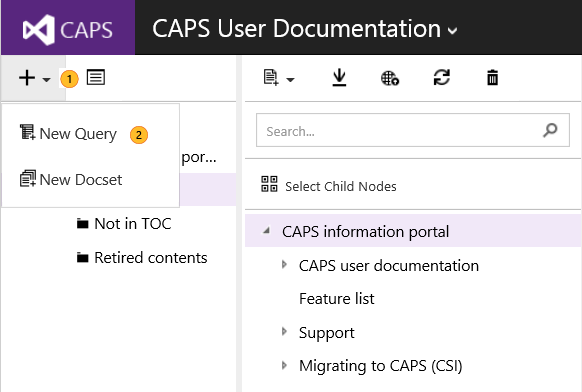
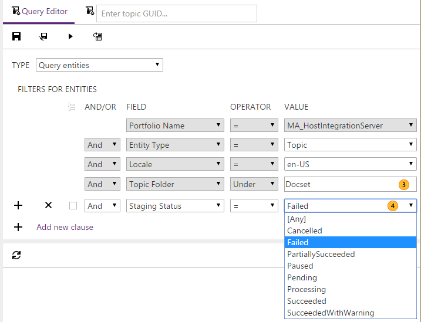

# Finding topics with publishing errors or warnings

Sometimes, when you publish content, you'll get warnings or errors in the publishing report. And while you can scroll through the lengthy XML publishing report, there's an easier way to find the topics that didn't publish successfully: Staging Status.

Just create a query to find the topics that have issues:

 
 

And then query by Staging Status:

 

Notes 
---

To find  |Query for  
---------|---------
Topics with warnings     | Staging Status = SucceededWithWarning         
Topics with errors       | Staging Status = Failed         

