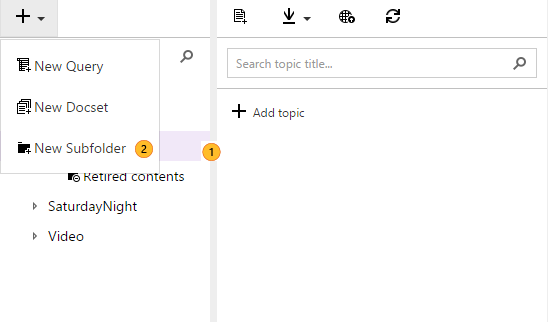

# Grouping assets

You can group the following assets:
* Topics in **Not in TOC** section
* Topics in **Retired contents** section
* Tokens
* Images
* Queries
* Localization handoffs
* Localization hand backs

> **NOTE: You cannot add folders to the TOC, to avoid complexity and ensure that the TOC that you see matches what your customers will see.**

## Creating folders for grouping

1. In order to group the assets, just click on the asset type you would like to add a new folder or on an existing folder to create a subfolder
2. Click on the plus sign on the right top and select **New Subfolder**
3. Give the folder a name

## Creating assets within a subfolder
1. Click on the folder, and then in the + sign on top of the Search box
2. Add the asset
3. The asset will be created within that folder

## Moving an asset to a folder
1. Right-click on the asset and select **Cut**
2. Right-click on the folder and select **Paste**
3. The asset will be moved within that folder

## Moving an asset out of a folder
1. Right-click on the asset and select **Cut**
2. Right-click on the location where you would like to place the asset
3. Select **Paste**
4. The asset will be moved to the new location