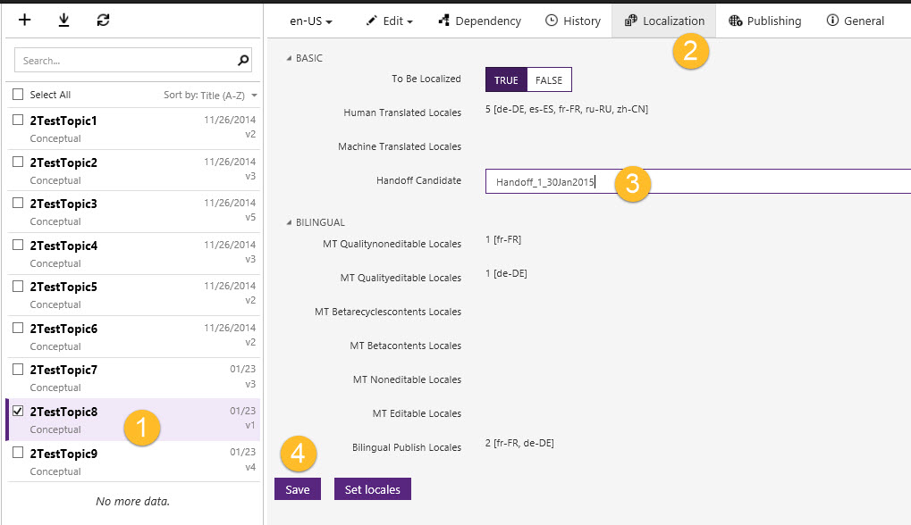

# Handoff Candidate Field
**In this topic**

-   [Handoff Candidate Field](#HandoffCandidateField)

-   [Using the Handoff Candidate Field](#UsingHandoffCandidate)

## Handoff Candidate Field
During the localization process you may want to organize or categorize your topics for different handoffs.  The Handoff Candidate field is a text field that allows you to type in a label or tag value in the field which you can use in your queries to search and organize your topics for handoff.    This value is set at the topic level.

## Using the Handoff Candidate Field
Select the topic to which you want to add a Handoff Candidate value.  Next type in the tag value into the Handoff Candidate field and click on the Save button to save your work.

|||
|-|-|
||Select the topic you want to edit.|
||Select the **Localization** tab.|
||Type in a value in the  **Handoff Candidate** field.|
||Click on the **Save** button.|
Note:  You can also edit the Handoff Candidate value as part of a bulk editing operation.

