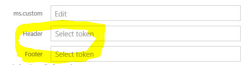

# Header and Footer Tokens
You can create tokens to use as header and footer text in your content, such as pre-release slugs, feedback requests, etc. The tokens can be written in markdown or DDUEML.

For instructions on how to create/edit new tokens, see [Creating a token](https://sandboxmsdnstage.redmond.corp.microsoft.com/en-us/library/dn942382.aspx#CreatingToken). Make sure the tokens are created before adding them to a topic. Tokens must be in the same portfolio as the topic you want to add it to.

### Adding a token to the header/footer of a single topic
1. Select the topic that you want to add a header to.
1. Click on the Publishing tab to open publishing options.
1. Scroll toward the bottom and look for the Header and Footer options.

1. Click on either the Header or Footer field to see a drop-down list of available tokens.
   >[!NOTE]You must use DDUEML tokens for DDUEML topics, Markdown tokens for Markdown topics. The list of available tokens will only include tokens in the language of the current topic.
1. Select the desired header or footer token from the list (or type the name).
1. Click Save and publish as normal.

### Removing a token from the header/footer of a single topic
1. Select the topic that you want to add a header to.
1. Click on the Publishing to open publishing options.
1. Scroll toward the bottom and look for the Header and Footer options.
1. Click on either the Header or Footer field and delete the text.
1. When the previous token text is clear, the field will have "Select token" again.

### Adding a token to the header/footer of multiple topics
**Using Select Child Nodes**
1. Select a topic that has children.
1. Click the Select Child Nodes option above (below search). This will select all of the children topics.
1. In the right side of the screen, select the Publishing tab.
1. Scroll toward the bottom and look for the Header and Footer options. They behave the same way as the header/footer fields for individual articles (except that the changes affect more than one topic).
1. Click Save and publish as normal.

**Using queries**
1. See [Creating, Updating, and Managing Advanced Queries](https://sandboxmsdnstage.redmond.corp.microsoft.com/en-us/library/dn942408.aspx) for background on how queries work.
1. Run the query you want to use to find topics to update.
1. From the results, select the items you want to update.
   * Click the checkbox in the table header to select all results, OR
   * Select multiple topics by using CTRL/Shift and clicking (like selecting multiple anything in Windows) .
1. At the bottom of the page select the Publishing tab.
1. Scroll toward the bottom and look for the Header and Footer options. They behave the same way as the header/footer fields for individual articles (except that the changes affect more than one topic).
1. Click Save and publish as normal.

### FAQ

Q: Can I add header/footer tokens at the docset level?

A: No. The original feature was for docset-level headers/footers, but a very common scenario is to add boilerplate to a subset of a docset. For example, you would generally only add pre-release text to topics covering new features in a CTP. So we would need to have topic-level override, at which point either the CAPS logic or the customer experience would get complicated. So we implemented topic-level only as the simplest and cheapest solution, and will rely on bulk updates to add tokens to an entire docset or a subset of a docset.

Q: Will we have docset-level functionality in the future?

A: Perhaps, but given the size of the CAPS backlog you are strongly encouraged to try the functionality as it is and see if it meets your needs!

