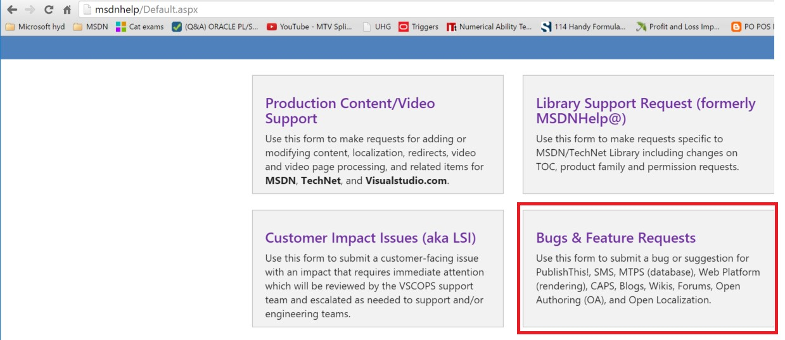
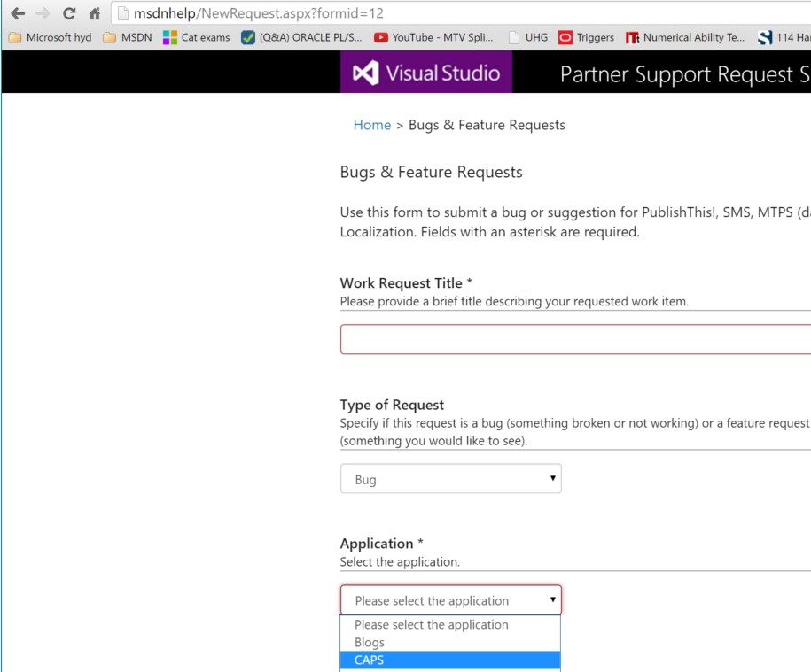
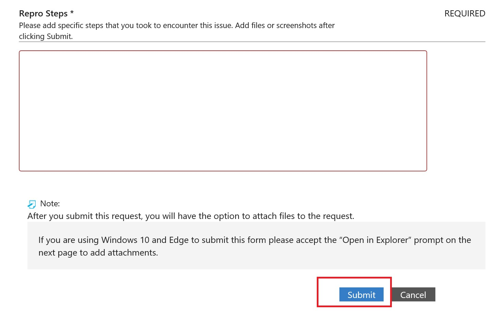
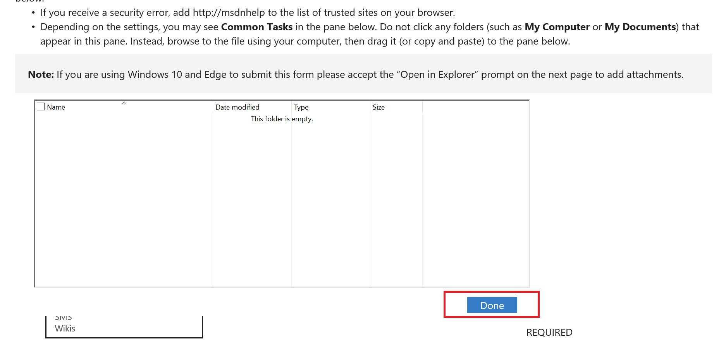

# How to file a Bug
File a bug when **CAPS in DevInt** is not functioning as designed, or if you need a new drop-down value for existing metadata in CAPS.

## Filing CAPS Bug via msdnhelp/
1)	Open a browser and render http://msdnhelp/ and click on “Bugs &amp; Feature Requests” as shown below:

2)	This would take you to the below screen, where you will enter “Title”, and choose “CAPS” from “Application Dropdown” and select “BUG” from TypeofRequest Dropdown.

3)	Fill in the required details per issue in “Affected Area”, “Issue Severity”, “Description”, “Repro Steps” and click on Submit, as shown below

4)	Once the submit is done, it takes you to the next screen where you can drag and drop any attachments related to issue can be referred and then click on “DONE”

Once the above step is completed, a TFS work-item is created and assigned to respective owner and an email is sent accordingly CCing you on it.

**Note: Please email VSCOPS or ping/mail visuram@ in case of any issues/questions while filing CAPS Bugs/FRs from msdnhelp/**

## Bug SLA

-   Priority 1

    -   SLA for 1st triage (CSI PM): Daily at 5pm Redmond time. We check that the bug is not duplicated, has the necessary steps, and it is indeed a bug, not a feature request. If the bug is approved, it will contain a tag called "CSITriaged" so we can follow it.

    -   SLA for 2nd triage (VSC PM): Assigned to the right person within to 24 business hours since CSI triages the bug.

    -   SLA for spring assignment: Assigned to a Sprint within 7 business days -&gt; Area path will change

    -   SLA for fixes: Fix will be done no later than next sprint (depending on other priorities) -&gt; Iteration path will change

-   Priority 2

    -   SLA for 1st triage (CSI PM): Daily at 5pm Redmond time. We check that the bug is not duplicated, has the necessary steps, and it is indeed a bug, not a feature request. If the bug is approved, it will contain a tag called "CSITriaged" so we can follow it.

    -   SLA for response: Assigned to the right person within 48 business hours since CSI triages the bug.

    -   SLA for spring assignment: Assigned to a Sprint within 7 business days. The team decides when it is going to be fixed depending on other priorities. Even a bug is assigned to a sprint, it can be postponed to another sprint based on other priorities or more urgent bugs coming. -&gt; Area path will change

    -   SLA for fixes: Fix will be done no later than next sprint (depending on other priorities) -&gt; Iteration path will change

-   If we have any questions, we will assign the bug back to you for further information.

-   Once the bug is fixed, it will be resolved and assigned back to you for validation.

