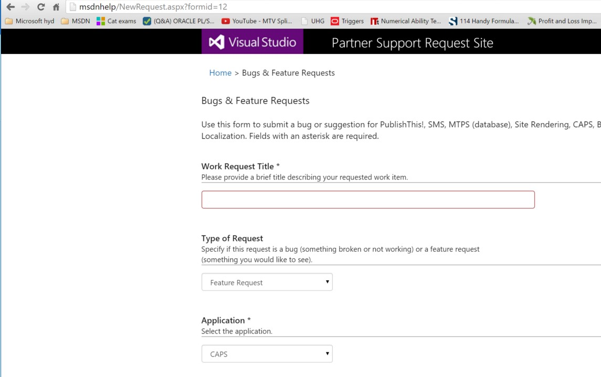

# How to file a Feature Request
File a feature request to ask for CAPS new features or for a change to the design an existing feature or functionality.

## Filing CAPS FR via msdnhelp
1)	Open a browser and render http://msdnhelp/ and click on “Bugs &amp; Feature Requests” as shown below:

2)	This would take you to the below screen, where you will enter “Title”, and choose “CAPS” from “Application Dropdown” and select "FEATURE REQUEST” from TypeofRequest Dropdown

3)	Fill in the required details per issue in “Affected Area”, “Issue Severity”, “Description”, “Repro Steps” and click on Submit, as shown below

4)	Once the submit is done, it takes you to the next screen where you can drag and drop any attachments related to issue can be referred and then click on “DONE”

Once the above step is completed, a TFS work-item is created and assigned to respective owner and an email is sent accordingly CCing you on it.

**Note: Please email VSCOPS or ping/mail visuram@ in case of any issues/questions while filing CAPS Bugs/FRs from msdnhelp/**

## SLA
Feature requests will be reviewed for consideration within 7 days. There is no guarantee that requests will be accepted and no SLA for implementation.

## What happens with my request?
Your request will be assigned to the CSI CAPS PM or a designated SME, who will follow up with you as necessary for details. Once the request is understood, it will be evaluated to determine whether it meets the criteria to be submitted to the CAPS team as a feature candidate for a release. If so, it will be prioritized against other features and recommended for implementation in an upcoming sprint. The CAPS team will do their own analysis and decide whether/when to commit to implementing the feature.

