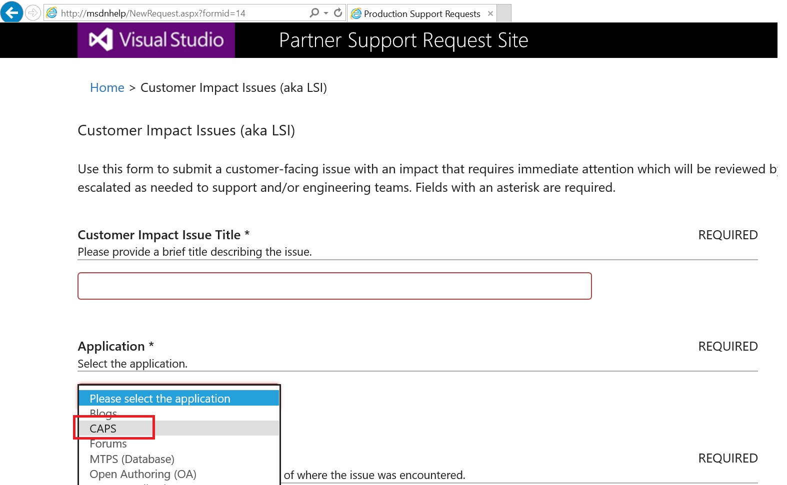
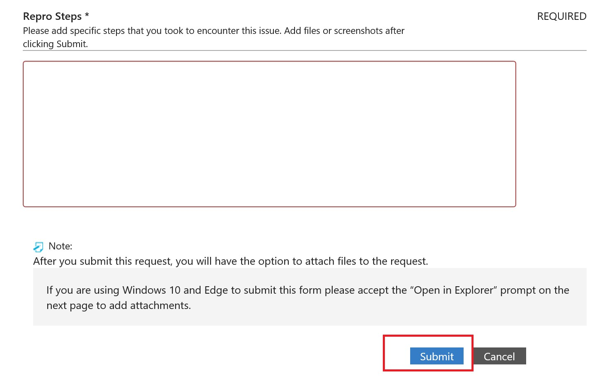
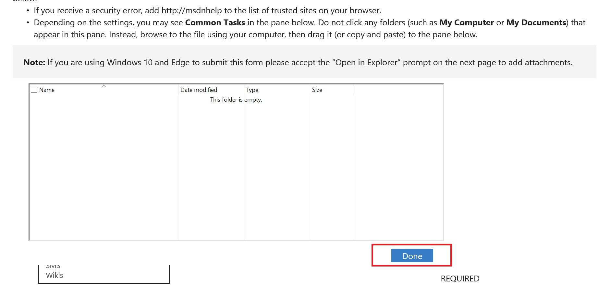

# How to file a Live Site Issue (LSI)
File an Issue when you are facing a problem with **CAPS in the production environment**.

In this topic:

-   [Filing a CAPS live site issue from msdnhelp:](#FilingLSI)

-   [Priority description and SLA:](#PriorityAndSLA)

-   [Validating the issue is resolved](#ValidatingLSI)

-   [On Call Rotation](#LSIOnCall)

## Filing a CAPS live site issue from msdnhelp:
1)	Open a browser and render http://msdnhelp/ and click on “Customer Impact Issues (aka LSI)” as shown below:

2)	This would take you to the below screen, where you will enter “Title”, and choose “CAPS” from “Application Dropdown”

3)	Fill in the required details per issue in “Affected Area”, “Issue Severity”, “Description”, “Repro Steps” and click on Submit, as shown below

4)	Once the submit is done, it takes you to the next screen where you can drag and drop any attachments related to issue can be referred and then click on “DONE”

Once the above step is completed, a TFS work-item is created and assigned to VSCOPS and an email is sent accordingly CCing you on it.

**Note: Please email VSCOPS or ping/mail visuram@ in case of any issues/questions while filing CAPS LSIs from msdnhelp/**

## Priority description and SLA:

|Priority|Description|SLA|
|------------|---------------|-------|
|P0|-   CAPS Portal or Service is completely down|-   **Detection** time: 5 mins -   **Response** time: 15 mins -   **Mitigation** time: 4 hours|
|P1|•	Blocks a main business event or release  •	Important/Major feature not working and blocking publishing, applies for single user as well  •	Publishing doesn’t work or too slow (Example: 10K topics’ publishing is taking more than 2 hours)  •	Handoff or Handback (Localization) issues, blocking a release  •	Content data loss for entire project (Docset Level) before publishing  •	Issues with Page layout at TOC or docset level during publishing  •	Any other (code snippets, metadata changes for “multiple topics” etc.) LSI having an End user impact|-   **Detection** time: 1 hour -   **Response** time: 1 business day -   **Mitigation** time: 5 business days|
|P2|•	Single client crashes.  •	Intermittent performance issues or content loss at Topic level.  •	Failing scenarios with a workaround.  •	Single scenarios failure, which is not blocking an event/team  •	Performance issues of a specific functionality  •	Some tasks that cannot be done via the UI --&gt; Portfolios management, Docsets management,  creating a dump of the content (DDUEML, images, tokens, metadata), etc.,.|-   **Detection** time: 2 hours -   **Response** time: 5 business days -   **Mitigation** time: 15 business days (one sprint)|
|P3/P4|DO NOT USE. Enter a bug instead. See instructions[here](http://msdnhelp/NewRequest.aspx?formid=12).|N/A|

## Validating the issue is resolved
In the Issue template, we do not have Resolved value. So the way to validate than an issue has been resolved is a bit different.

-   Once the engineering team has solved the issue, the issue will be closed and assigned back to you.

-   You will get an automatic e-mail indicating the issue is solved.

-   Please review and, if you agree, then remove your name from the Assigned To field and add a note indicating you validated the issue is solved.

-   If you do not agree with the resolution, activate it and it will go back to the engineering team.

-   Save the issue.

## On Call Rotation
You can find the current on call person at [here](https://icm.ad.msft.net/imp/CurrentOnCall.aspx?teamId=0&tenantId=20342&incdep=0&incvirt=1&mode=chain).

