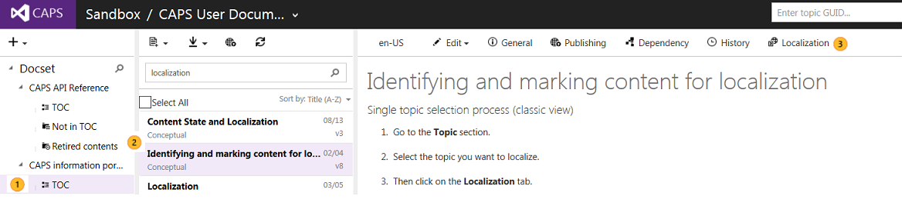
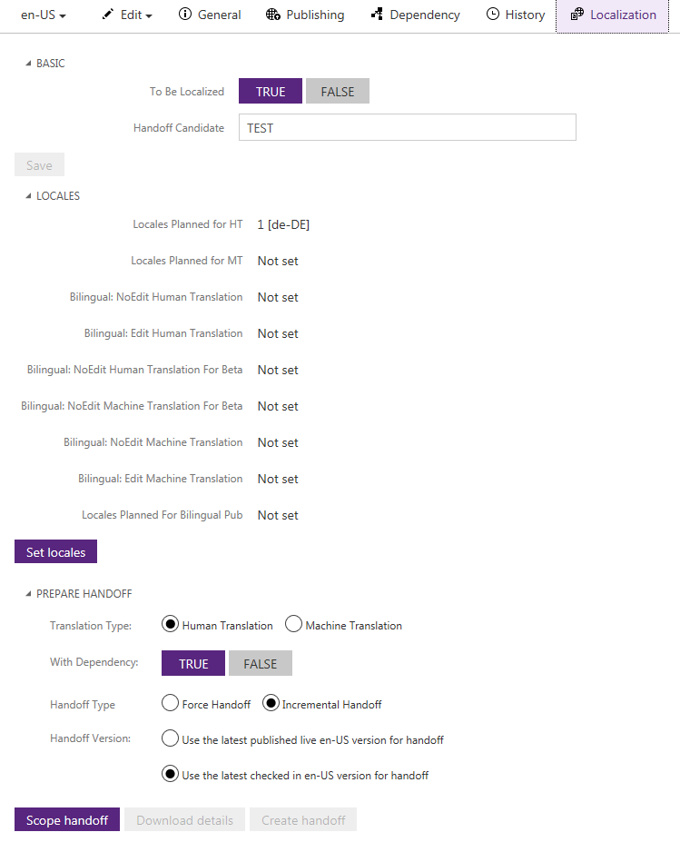
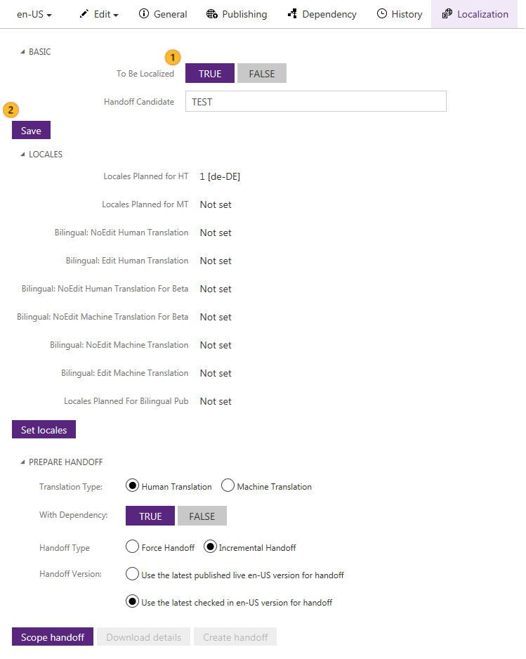
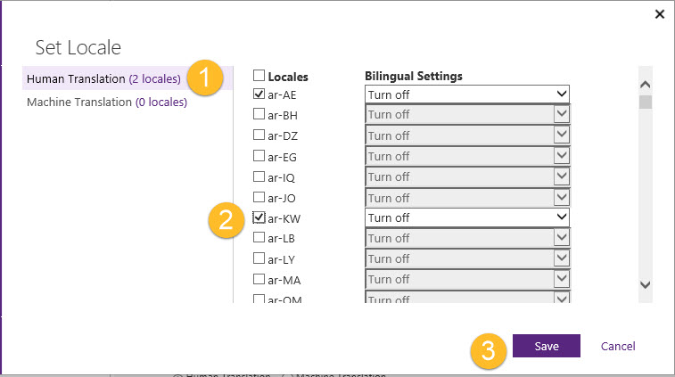
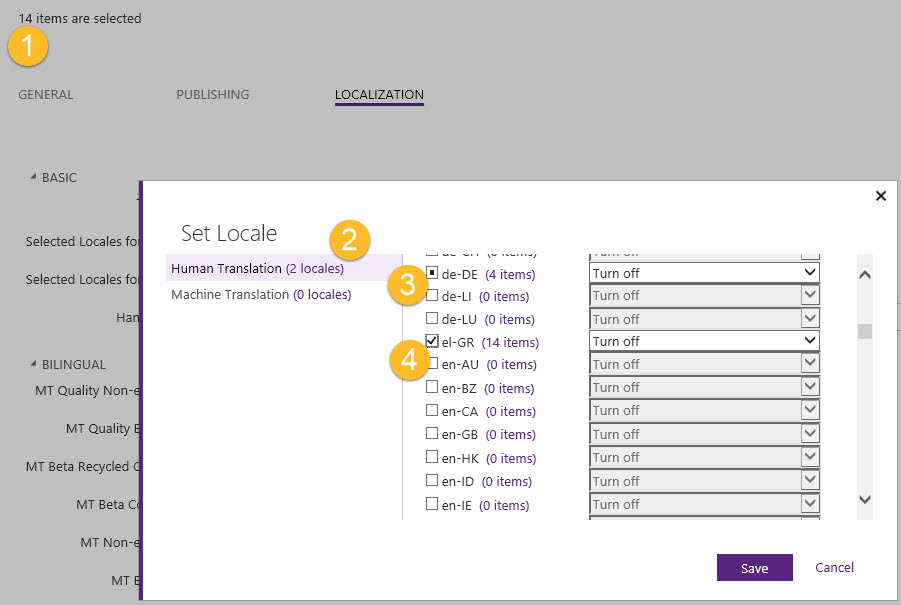
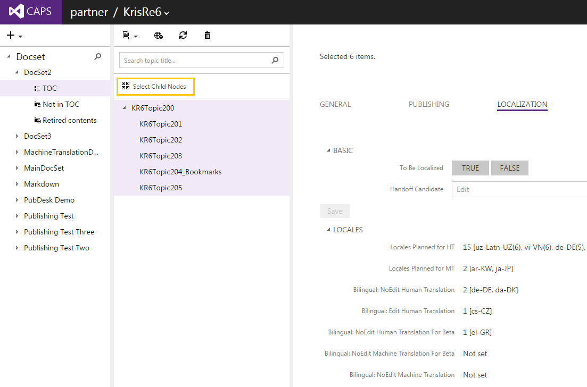

# Identifying and marking content for localization

## Single topic selection process (classic view)

1.  Go to the **Topic** section.

2.  Select the topic you want to localize.

3.  Then click on the **Localization** tab.

You should see the metadata for the Localization tab.

> [!NOTE]
> You will only be able to edit the localization metadata from the default language view.  In the example above the default language is en-US.

Make sure that your topic has been marked for localization.  To enable the topic to be handed off to Localization,

1.  Click to set **To Be Localized** to **TRUE**.

2.  Then click on the **Save** button.

> [!NOTE]
> It is important that you click on the **Save** button in the Localization panel after modifying the metadata value for **To Be Localized** to save your changes.  This is also true when you want to save your changes to the **Handoff Candidate** field.  It is easy to edit the **To Be Localized** value or the **Handoff Candidate** value and launch right into the **Set Locales** workflow.  The **Localization** pane and the **Set Locales** workflow have separate save mechanisms so you need to be mindful when saving your changes.
> 
> If you forget to save your changes in the **Localization** panel CAPS will remind you with an Alert pop-up, "You have unsaved changes.  Click OK to close and lose changes."

## Setting locales
The next steps are to set the locales into which your topic will be translated.  There are two quality levels from which you can choose, Human Translation and for Machine Translation.  To set the locales for your topic click on the **Set Locales** button.

Next,

1.  Choose the translation quality level for your locales, either **Human Translation** or **Machine Translation**.

2.  Then select all the locales for that topic for that quality level from the checkbox list. Repeat the process for the other quality level  if you will be localizing the topic for both translation quality levels in different locales.

3.  When you are all done click on the **Save** button.

> [!NOTE]
> You can't have the same language selected for both **Human Translation** and **Machine Translation** quality levels.

After you mark your topic for localization, CAPS now knows that your topic can be handed off for localization and for which locales.  In the example above, if the topic is part of a Human Translation handoff, it will be handed off for United Arab Emirates (Arabic) and Kuwait (Arabic).

## Bulk editing topics selection process
You can also set topics, images, and tokens to be marked for localization using the bulk selection options in CAPS.

If you have multi-selected a set of topics and opened the Set Locales workflow, your selected topics may have different locale settings across your set of selected topics.  CAPS helps you spot those differences through the user interface.  From the Localization pane you can see the number of topics in your selection set.  The Set Locales dialog lists total number of locales per translation quality level and shows the number of items per locale for that quality level.  A square icon in the check box means that one or more of the items in the current selection set have been marked for that locale.  The number following the locale name tells you how many have been marked.   A check box indicates all of the selection set has been marked for that locale.

|||
|-|-|
||The number of items, topics, in your selection set.|
||The number of locales marked for the selected translation quality level.|
||The square icon show a partial selection of items.|
||The check box shows that all of the items in the selection set are marked for that locale.|
In the example above the selection set consists of a total of 14 topics.  The total number of locales selected for Human Translation is two, German and Greek.   German has 4 of the 14 topics set to be translated, denoted by the square icon in the check box.  Greek has all 14 topics set to be localized into Greek denoted by the check in the check box.  An empty check box indicates that locale has not been selected for the topics in the selection set.

If you don't alter the German selection before clicking on the Save button, then CAPS will preserve the existing settings for German.  Only the previously marked topics will be set for German.  The other topics in the selection set will not be marked for German.

Many users will use a query to find  all topics that meet a certain criteria and then bulk edit those topics.

In the Doc Sets view, you can multi-select topics from the TOC by clicking on one topic then holding down the CTRL key and clicking on one or more topics.  You can also select multiple topics using the Select Child Nodes option near the top of the topics column.

## See also
[Creating a handoff](../Topic/Creating-a-handoff.md)

[Processing a hand back](../Topic/Processing-a-hand-back.md)

