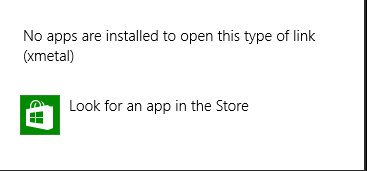

# Installing XMetaL 9.0
You need XMetaL 9.0 for a rich experience authoring DDUEML documentation. XMetaL works in Windows 8.1 as well as in Windows 10 machines.

**In this topic**

1.  [Installing XMetaL](#InstallingXMetaL)

2.  [Installing XMetaL CAPS Authoring tool Add-in](#InstallingXMetaLAdd-in)

3.  [Registering XMetaL](#RegisteringXMetaL)

4.  [Un-registering XMetaL](#UnregisteringXMetaL)

5.  [XMetaL 9.0 and DxStudio 2.0](#XMetaLDxStudio)

## Installing XMetaL
CAPS only works with XMetaL 9.0. 
In order to access the CSI-wide licenses for XMetaL Essential 9.0 and author content in CAPS, please follow these steps.

When you run the installation  for XMetaL 9.0, if you currently have XMetaL 7.0 installed the installation wizard will upgrade XMetaL 7.0 to 9.0.

1.  If you are in CSI, please join the following Security Group in [idweb](http://idweb): "STB XMetaL License Mgmt". Exception: If you are in the Wingroup domain, join "STB XMetaL License Mgmt Wingroup" instead.

    You might need to wait up to 24 hours until your permissions are propagated. You will receive a message when you are approved.

    > [!NOTE]
    > If you are a vendor or a Microsoft FTE but outside CSI you will need to provide your own copy of XMetaL Author Essential, version 9.0.
    > 
    > **FTE**: contact software buy desk
    > 
    > **Vendors** need the agency to provide a copy of XMetaL Author Essential, version 9.0. [http://xmetal.com/content-xmetal-author/](http://xmetal.com/content-xmetal-author/) .  Having a XMetaL support agreement means upgrades as CAPS starts supporting newer versions. You can work through [http://xmetal.com](http://xmetal.com) or the Rep that CSI has at JustSystems, Ed Shoval: ed.shoval@justsystems.com
    > 
    > Contact Nelly Delgado (ndelgado) for questions.
    > 
    > A 30 day XMetaL trail is available for evaluation Install XMetaL 9.0 from [this share  ](file:///\\uafsall02\Public\XMetaL9)
    > 
    > For PubDesk XMetal licensing support see [XMetal Licensing](https://sandboxmsdnstage.redmond.corp.microsoft.com/en-us/library/40e6bbcf-5592-4c01-9f87-d31162a78a05.aspx).

    > [!NOTE]
    > If you are having trouble finding the Security Group in Chrome, please use Internet Explorer.

2.  Install XMetaL 9.0 from [this share  ](file:///\\uafsall02\Public\XMetaL9).

    > [!IMPORTANT]
    > If you cannot access the installation location for XMetaL (as in, you cannot **see** it or you get an error message that it doesn't exist), it is an access issue – give it a day, and try again. The folder IS there, even if you can’t see it yet.

3.  Follow the installation program to get XMetaL installed on your computer. Note that the installation executable is large, so please be patient as XMetaL will take several minutes to install.

## Installing XMetaL CAPS Authoring tool Add-in
> [!IMPORTANT]
> -   Install the XMetaL add-in once you have XMetaL installed.
> -   Not installing the add-in will give you the following error message when you are opening a topic in XMetaL: 
> -   You cannot install the CAPS authoring tool if you have already  the CLiX authoring tools installed on the same machine. They are part of the same code base,  but CLiX had it set to version 3.0 and CAPS is 1.2.  
>     So when installing the CAPS authoring tools, you will get an error message saying that there is already a newer version installed on your machine.

Find the latest build (setup.exe) from [CAPS Authoring Rolling Build](file:///\\ixptoolsfs01\builds\CAPS\Authoring\CAPS_Authoring_Master_RollingBuild), under Release\en-US folder.

Whenever the add-in updates, you will get a notification to install the latest version as soon as you open a topic with XMetaL from CAPS.

## Registering XMetaL

1.  Now you need to point to the license to register XMetaL. You can find it in a subfolder at [\\uafsall02\Public\XMetaL9](file:///\\uafsall02\Public\XMetaL9) the license sub-folder has security restrictions and may appear empty until permission propagates.

## Un-registering  XMetaL
We have a limited amount of licenses for all CSI. The licenses are per machine, so please be mindful and install XMetaL only on the machines you are intended to author content. Unregister your license before wiping your machine. Otherwise, we may lose the license.

1.  Open XMetaL.

2.  Click on **Help - Licensing**.

3.  Click on the **Remove License** button.

4.  Wait until you receive a confirmation message indicating that the license has been removed.

## XMetaL 9.0 and DxStudio 2.0
XMetaL 9.0 (version used by CAPS) and DxStudio 2.0 with DxEditor are compatible. You can have them in the same machine with no issues.

> [!CAUTION]
> You cannot have XMetaL 9.0 and XMetaL 8.0 (for DxStudio 3.0 and WDCML content) on the same machine.

