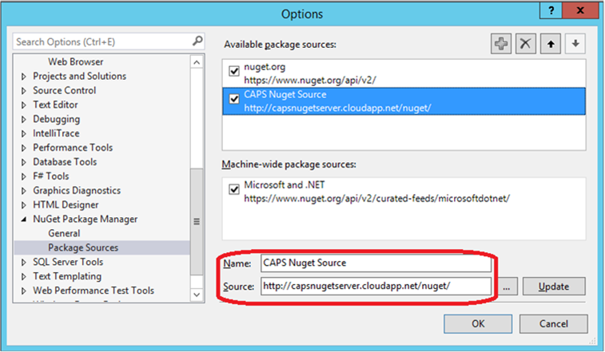

# Localization handoff and hand back
#Resources
* [Automated handoff / handback flow diagrams](https://microsoft.sharepoint.com/teams/Visual_Studio_China/ALPS/_layouts/15/VisioWebAccess/VisioWebAccess.aspx?id=/teams/Visual_Studio_China/ALPS/Shared%20Documents/Localization/AutomatedCapsLocalizationFlow.vsdx) 
* [Sample code]: \\indigofs\CommonShare\zhiliaxu\iCMS\Localization.Flow.Automation 

* [Meeting recorded with demo]: \\indigofs\CommonShare\zhiliaxu\iCMS\Sandra Aldana Abad, Kris Reynolds, Eo. . . - Thursday, April 9, 2015 9.18.18 AM.mp4

#Configuration
To download the Localization Client assemblies, you need to configure the [CAPS NuGet Source server](http://capsnugetserver.cloudapp.net/nuget/) in VS.

