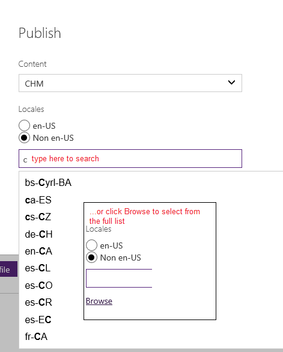
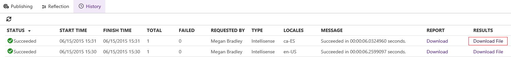

# MRef Builds and Publishing
## Publishing to MSDN
MSDN Publishing for managed reference is the same as conceptual publishing: you can publish an entire docset at once or individual topics, and by default only updated topics are published. This means you can publish small updates to large mref docsets faster and with less tax on the MSDN publishing pipeline than in DxStudio.

See the [Publishing](https://sandboxmsdnstage.redmond.corp.microsoft.com/en-us/library/dn942355.aspx) section for instructions.

As with conceptual topics, mref topics must have Ready to Stage/Ready to Publish Live set on each topic to be staged/published lived. This may sound daunting for reflection updates, when many topics may have been added, changed, or removed, and you likely won't be touching them all. To bulk publish reflection updates:

1. Query to return all topics in the docset (if you want to publish every topic that has changed), or all topics for which Updated By Reflection = TRUE (if you just want to publish all topics that were last changed by reflection). 
2. Click the Query Result tab.
3. Check the GUID box to select all topics returned.
4. On the Publishing tab, set the Ready to Stage flag to TRUE.
5. Select Publish --> Selected Topics (Content and TOC).
6. Click Publish to Publish to stage.
7. Repeat these steps with Ready to Publish Live = TRUE to push live.

## Building IntelliSense 
IntelliSense builds are XML builds that include only "Fair-level mref" content (that is, the class or member summary and descriptions for any parameters and return values). The files are built from the content in CAPS and then handed off to the product team to be checked in as IDE IntelliSense content.

1. On the Publishing tab for the Docset, click Create offline file. 
2. Select IntelliSense  from the Content drop-down list.
3. Choose en-US for English, Non en-US for localized builds.
4. For localized builds, choose the locale(s):
   
  

6. Click Publish.
7. When the build has succeeded, click the History tab.
8. Find your build and click Download File.
    
	
	
## Building Full XML 
In CAPS, you can buil XML files that contain all mref content, not just Fair-level content. The main scenario for this functionality is to provide CAPS content to your a product team to update XML comments in source code. Note that CAPS does not provide a tool to update source code -- this is the responsibility of the team that owns the code.

To build full XML files, follow the instructions above but select XML instead of IntelliSense.

## Building .chm and .docx
You can create .chm and .docx files for mref also. The process is the same as above -- just choose a different option. Note that very large mref projects may exceed the size limit for .chm; for example, the .NET Framework class library cannot be built as .chm.
