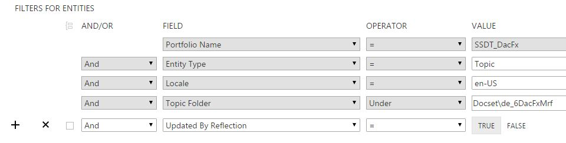

# MRef Queries
Unlike DxStudio, which requires you to query in separate views for conceptual, namespace, type, and member topics, CAPS includes mref topics in the canned queries, because mref topics all  have Entity Type = Topics. So when you click All My Topics or All My Checked Out Topics, for example, by default mref topics are included in the results.

There are also query fields you can use to return results specifically for mref topics. Here are some useful mref queries.

###Updated by Reflection

Updated by Reflection is a Boolean value set on each mref topic. You can see it on the General tab for the topic:

TRUE indicates that the last update to the topic was made by DLL reflection/XML comment import, as opposed to human authoring in CAPS. You can use this value to identify mref topics with updated syntax and/or XML comments.

To return all topics that were last changed by reflection for a docset,  use this query:

You can access this query from the Reflection tab:

Note that currently this flag must be reset manually, although [Feature 11438](https://capservice.visualstudio.com/DefaultCollection/CAPS/_workitems#_a=edit&id=11438) is open to flip the flag automatically on topic checkin. To ensure meaningful results until this change is implemented, it is recommended that you flip this flag on the General tab after editing a topic. When you have finished work on an mref docset for a milestone, you can query for all topics in the docset and flip the flag in bulk. The next time you run reflection, only newly changed topics will have Updated By Reflection = TRUE.

###Filter by Reference Type

You can query a portfolio or docset to find all mref topics or all topics of a particular mref type, such as all namespaces, all properties, etc. 

To find all mref topics, query for Topic Type = DDUE.MRef or Reference Type = Any.

To find specific mref topic types, select from the Reference Type dropdown list:

To find topics of more than one type, such as all methods and properties, add multiple clauses.

You can combine these with any other condition in the Query Builder. Here are two examples:

###Filter by Status
Add a Status clause, e.g. find all mref topics in Writing:

###Find Unassigned Topics
Use Assigned to = FALSE to find unassigned topics, in this case namespace topics:

###Can I find all mref topics currently checked out?
This has been requested, but is not yet available. You can add Checked Out By clauses to find topics checked out by specific people, but the Exists operator is not yet available to find all topics where the Checked Out By operator has a value; i.e. all checked out topics. [Bug 17315](https://capservice.visualstudio.com/DefaultCollection/CAPS/_workitems#_a=edit&id=17315&triage=true) is open on this issue.