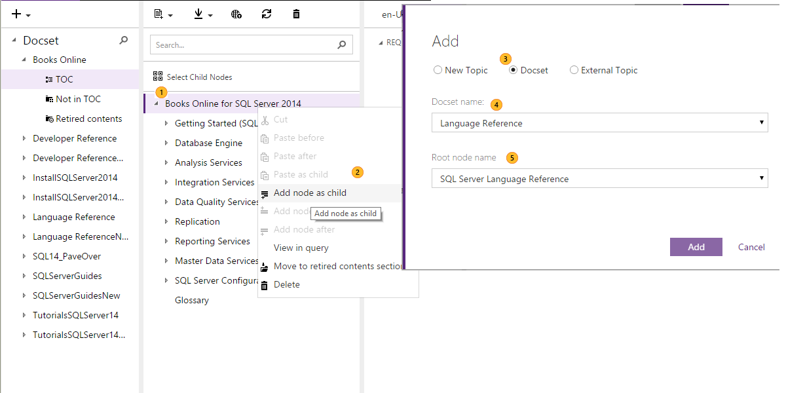

# Managing docsets
Note that not all users can create or manage docsets. Please see [Permissions](../Topic/Permissions.md).

In this topic:

-   [Creating a docset](#CreatingDocset)

-   [Updating docset metadata](#updatedocsetmetadata)

-   [Sharing a docset](#SharingDocset)

-   [Referencing to another topic in a different portfolio (or outside CAPS)](#ReferencingExternalTOC)

## Creating a docset

1.  Click to create a new docset. Note that in the same docset you can have both DDUEML and Markdown content.

    

2.  Select Conceptual or Mref and give the docset a meaningful name (for mref, you will be asked to provide additional information -- see [Reflection and Comment Import](../Topic/Reflection-and-Comment-Import.md)).

3.  Click **Create**.

4.  Your new docset will appear in the list of docsets. The docset is created with three subfolders:

    1.  **TOC** - These topics will be published to the MSDN/Technet Table of Contents.

    2.  **Not in TOC** - These topics will be published and can be linked to, but will not be in the TOC.

    3.  **Retired content**s - These topics will be retired from MDSN/TechNet.

5.  You can now add topics to your docset.

## Updating docset metadata
First, check out [Docset Metadata](../Topic/Docset-Metadata.md) to understand what you can and should set with regard to docset metadata. Most important of all metadata settings at the docset level is the **Product Family** and **Product Family Version**. Make sure you get these two right.

Ok, now you're ready to set some metadata:

1.  In CAPS, click the docset you want to set metadata for.

2.  You'll see the following Publishing metadata information:

    

3.  Make your changes - set the metadata values - and then click **Save**.

Ta da. Docset metadata, handled.

## Sharing a docset
You share one docset into another docset by adding a reference to the shared docset.

|||
|-|-|
||Expand the TOC for the docset that you want to share another docset into|
||Right-click a topic in the TOC where you want   the shared docset to appear, and then select a command to add the docset as a node: **Add node as a child**, **Add node before**, or **Add node after**.|
||In the **Add** dialog box, click **Docset**.|
||Select the docset that you want to share in.|
||Select one of the root nodes in the docset, and click **Add**.|

## Referencing to another topic in a different portfolio (or outside CAPS)
You can point to another topic in a different portfolio or outside CAPS. If the topic has children, all the children will be included as a reference in the TOC. Here is how.

|||
|-|-|
||Expand the TOC for the docset that you want to share another docset into|
||Right-click a topic in the TOC where you want   the shared docset to appear, and then select a command to add the docset as a node: **Add node as a child**, **Add node before**, or **Add node after**.|
||In the **Add** dialog box, click **External topic**.|
||**Name** - Enter the name for the target topic. CAPS cannot resolve the topic title for you, so enter the name as it will show in the TOC.|
||**Topic GUID** - This is the GUID of the target topic.|
||**TOC GUID** - This is the TOC GUID of the target topic.|
||**Product Family** - The product family of the target topic.|
||**Product Version** - The product family version of the target topic.|
||Click **Add** when you are finished.|
