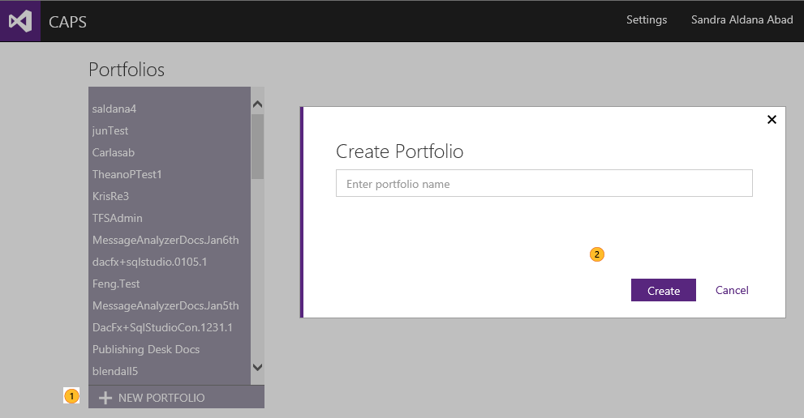

# Managing portfolios
In this topic

-   [Creating a portfolio](#CreatingPortfolio)

## Creating a portfolio
You can create portfolios and add both DDUEML schema and GFM MD (Git Flavor Markdown) from CAPS home page.  A portfolio should contain all the contents for a given release.

Under **[!INCLUDE[Portfolio](../Token/Portfolio_md.md)]**, you will see the portfolios that are already created.

|||
|-|-|
||Click on **+ NEW PORTFOLIO** at the bottom of the list.|
||In the **Create [!INCLUDE[Portfolio](../Token/Portfolio_md.md)]** window, give your portfolio a name and click **Create**.  Your portfolio will be created and appear at the top of the portfolio list.|
> [!IMPORTANT]
> If **+ NEW PORTFOLIO** is unavailable (dimmed), you do not have permissions to create a portfolio in the CAPS environment. Contact your CAPS administrator for assistance.

