# Managing topics
**In this topic**

-   [Renaming topics](#renamingTopics)

-   [Topic metadata](#topicMetadata)

-   [Setting metadata on a single topic](#settopicmetadata)

-   [Setting metadata for more than one topic (bulk edit)](#bulkeditmetadata)

-   [Viewing topic history](#viewingTopicHistory)

-   [Displaying topic versions](#Displayingtopicversions)

-   [Moving a topic](#Movingtopics)

-   [Downloading a topic](#bmkm_downloadtopic)

## Renaming topics
Use the **General** metadata tab to change topic **Title** or **TOC Title**.

Click on **Save** when you are done.

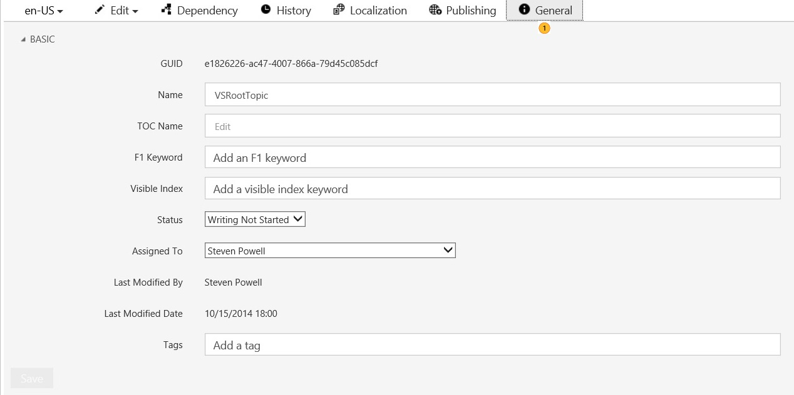

## Topic metadata
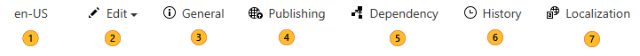

|||
|-|-|
||Use the language drop-down to choose the language version of the topic that you want to see. If no localized content is available, only English (en-us) will appear.  This is only an approximation as publishing the topic is the only way to truly see what it looks like.  If you have any broken dependencies (link, art, token) in the topic that you are displaying, you will see a message highlighted in yellow indicating that the reference could not be found. Example:  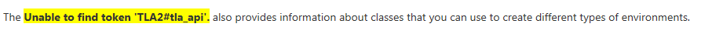|
||Use the **Edit** menu to modify the topic, see [Editing a topic in XMetaL](../Topic/Editing-a-topic-in-XMetaL.md), [Editing a topic in the web editor](../Topic/Editing-a-topic-in-the-web-editor.md), [Creating and updating Markdown topics](../Topic/Creating-and-updating-Markdown-topics.md).|
||Use the **Dependency** tab to see the other assets upon which this topic depends (images, tokens, linked topics). The dependencies are grouped by category. Click on any of the links under dependency to go to the dependency in a new tab.|
||Use the **History** tab to view changes to the topic and its metadata, see [Viewing topic history](#viewingTopicHistory)|
||Use the **Localization** tab to see and edit the topic's localization metadata, create a handoff, etc. See [Localization](../Topic/Localization.md)|
||Use the **Publishing** tab to see the topic's publishing information, including links to staged and live content|
||Use the **General** tab to view and set general metadata, such as title, keywords, tags, status, etc. See  [Topic Metadata](../Topic/Topic-Metadata.md) for a complete list.|
> [!TIP]
> Remember to click **Save** to persist your changes

## Setting metadata on a single topic
First, just like with the docset, you need to read up on the available topic-level metadata: [Topic Metadata](../Topic/Topic-Metadata.md)

Ready? First, set the General metadata, which identifies the topic and who is responsible for it.

1.  In CAPS, in the TOC view (middle pane of the window), click the topic you want to set metadata for.

2.  Click **General** to open the **General** metadata tab.

    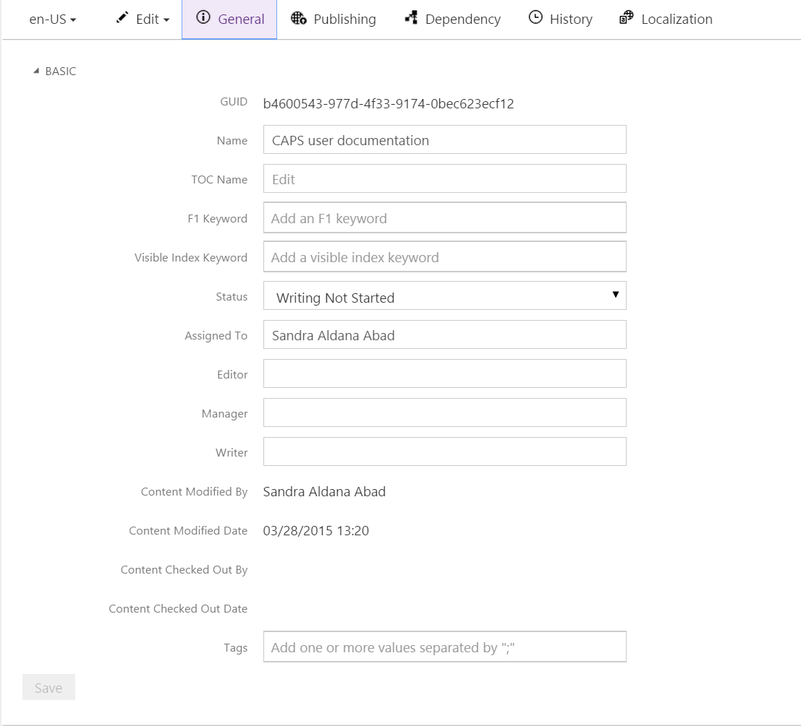

3.  Set what you want to set, and then click **Save**.

Now, let's set the publishing metadata for the topic.

1.  In CAPS, in the TOC view (middle pane of the window), click the topic you want to set metadata for.

2.  Click **Publishing** to open the **Publishing** metadata tab.

    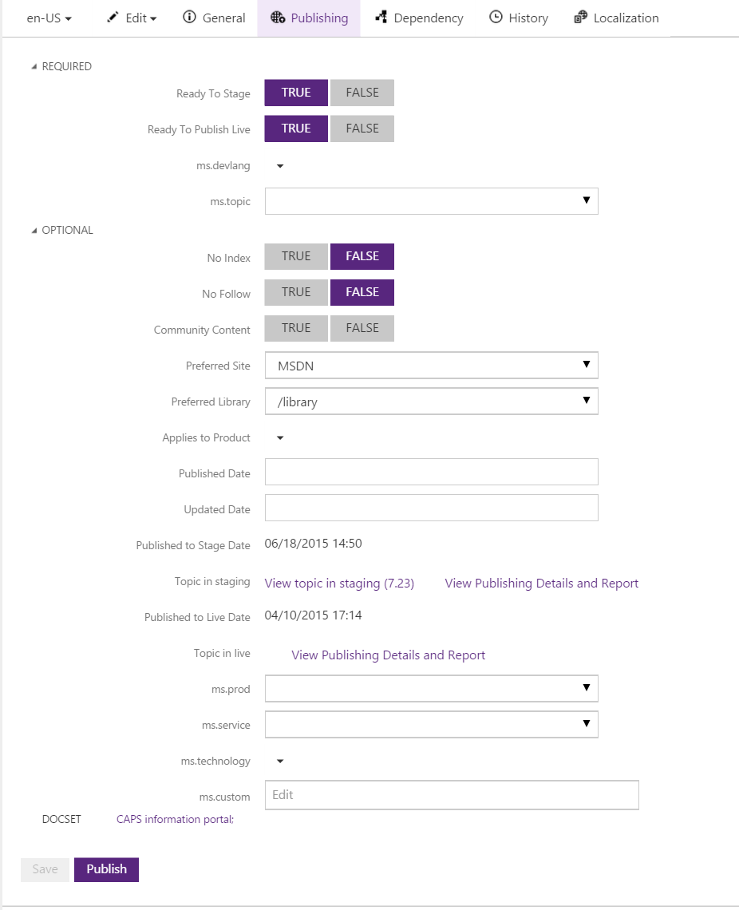

3.  Set what you want to set, and then click **Save**.

    If you're ready to publish now, go ahead and click **Publish**.

## Setting metadata for more than one topic (bulk edit)
You can set metadata on more than one topic at time, but the metadata you can set this way is limited (which makes sense - you wouldn't want multiple topics to have the same TOC Title).

1.  In CAPS, in the TOC view (middle pane of the window), click a topic you want to set metadata for. Now, you can Ctrl+click the other topics you want. You can also use Select Child Nodes to select all topics under a particular node of a docset, or select all the results of a query.

2.  By default, you'll see the General bulk editor:

    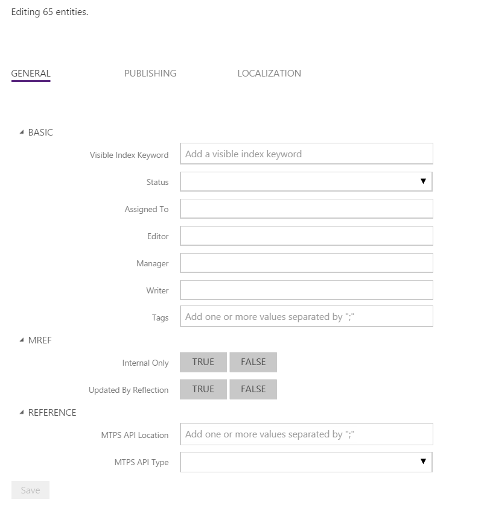

3.  Set what you want to set, and then click **Save**.

4.  Want to set publishing metadata? Just click **Publishing**.

    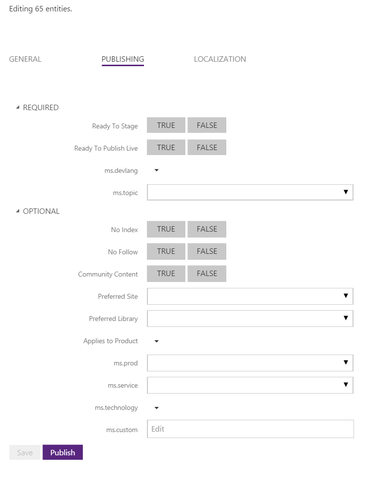

5.  Make any changes (for example, change the **Ready to Publish to Live** flag), and then click **Save**.

6.  If you're ready to publish now, you can go ahead and click **Publish**. Otherwise, you can close the bulk editor by clicking any topic in the TOC.

## Viewing topic history
You can see changes to topic content or to topic metadata by  viewing the history.

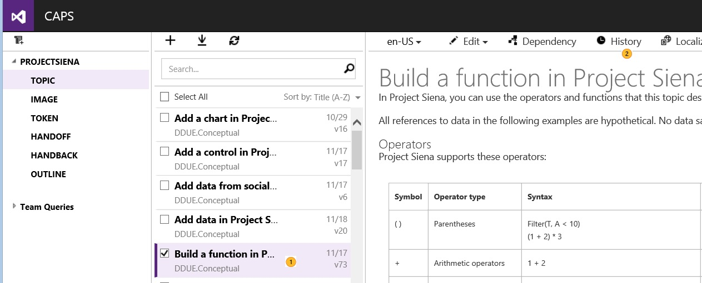

|||
|-|-|
||Highlight the topic whose history you want to view|
||Click the **History** tab|
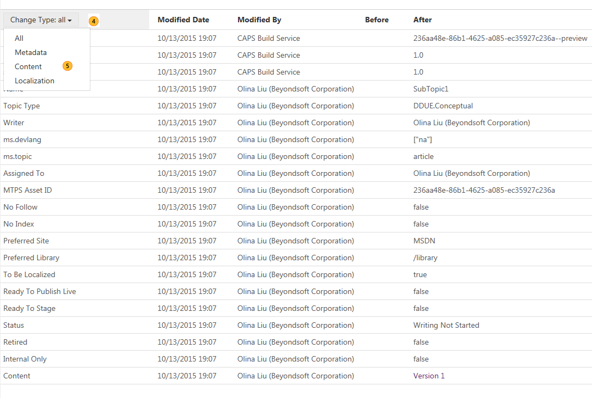

|||
|-|-|
||When you're done, close the tab.|
||You can use **Change Type** to filter the results|
||Choose **Content** if you want to see only changes to topic contents and to compare with the previous version of the topic|
After you filter to show only content, you see:

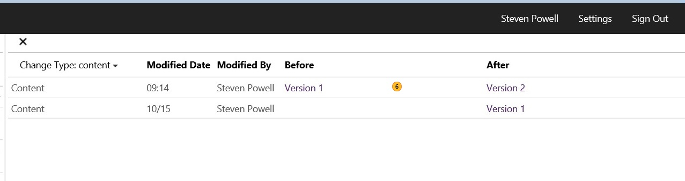

|||
|-|-|
||Click the link for either the previous or current version to see a side-by-side comparison with highlighted differences.|
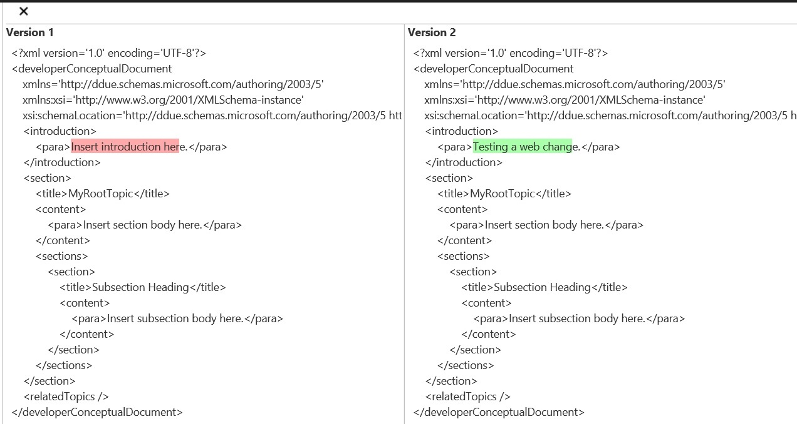

## Displaying topic versions
In topic preview, CAPS shows three versions for a topic. This way, you can know if you need to publish again a topic or not, or what is the delta between what the CMS and MTPS: 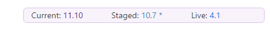

-   **Current** - Displays the latest version that was checked-in.

-   **Staged** - Displays the latest version that was published to MTPS stage. Clicking on the link with the version will take you to the topic on the staging server.

-   **Live** -  Displays the latest version that was published to MTPS live. Clicking on the link with the version will take you to the topic on the live server.

Out of each version, there are to parts:

1.  Number before the dot. This is the actual checked-in version. It starts at 1 at topic creation. If there is any content changes triggered by check in, the number before the dot will increase by 1.

2.  Number after the dot. It starts at 0 (zero) at topic creation. If either topic title OR visible index keyword (localized metadata) changes, the number after the dot will increase by 1.  This number never gets reset to zero.

## Moving a topic
You can move one or more topics within the same docset, or to another docset.  This section covers moving topics to a location in the TOC and to the **NOT in TOC** folder. For information on moving topics to the **Retired contents** folder, see [Retiring Content (AKA Paving Over)](Retiring-Content--AKA-Paving-over-.md).

> [!NOTE]
> The topic can be a parent topic. If you are moving a parent topic, all its children will move as well.

> [!IMPORTANT]
> You can also select multiple topics with Ctrl or SHITF keys.

> [!IMPORTANT]
> If you are moving a topic to a different docset, you need to have at least one topic in the target docset already. You cannot move a topic to an empty docset.

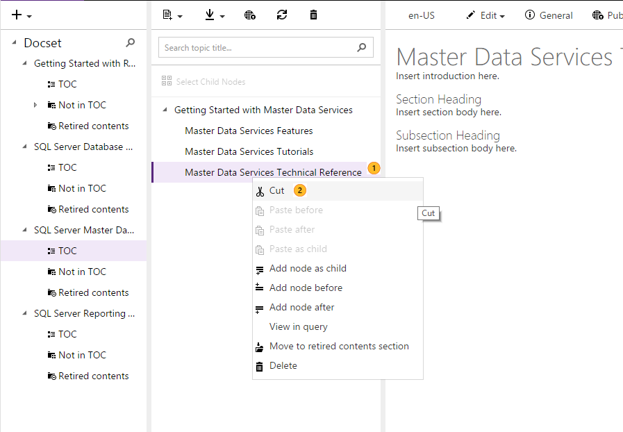

|||
|-|-|
||Select the topic(s) that you want to move. To select multiple topics, use Ctrl plus your mouse button.|
||Right-click and select **Cut**.|
**To move a topic to a location in the TOC**

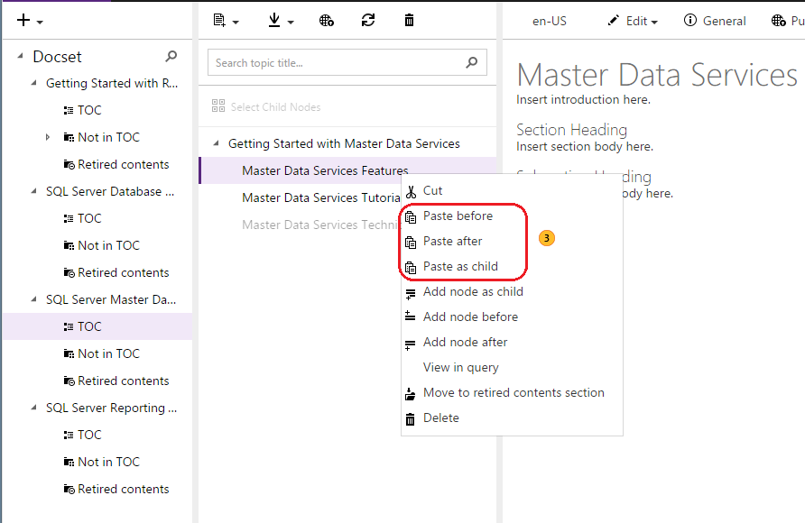

|||
|-|-|
||Right-click  the location in the docset TOC that you want to move the topic(s) to, and then select **Paste before**, **Paste after**, or **Paste as child**.|
**To move a topic to the NOT in TOC folder**

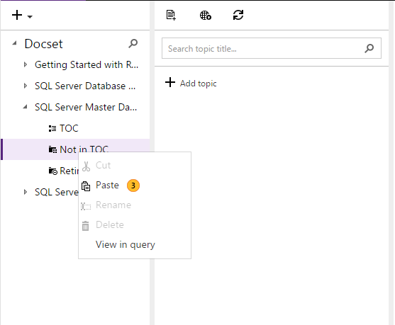

|||
|-|-|
||Right-click the **NOT in TOC** folder, and then click **Paste**.|

## Downloading a topic
Open the CAPS portfolio for which topic you want to download. Note that you can download only one topic at a time, or create a Word document or a CHM file for the full docset. 

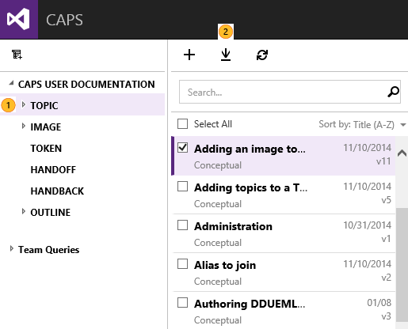

|||
|-|-|
||Click **Topic** in the left-hand pane.|
||Click on the **Download** sign.|
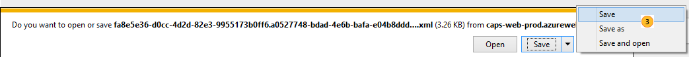

|||
|-|-|
||Select the saving option you would like.|
