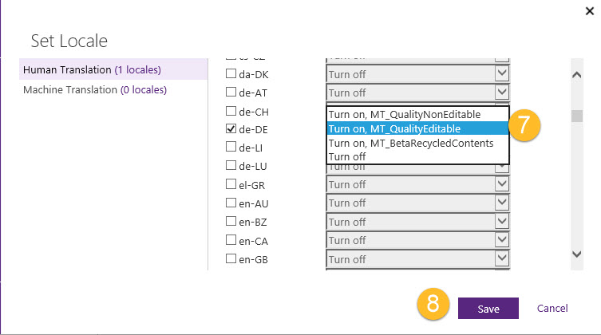

# Mark Topics for Bilingual Publishing
**In this topic**

-   [What is bilingual publishing?](#Whatisbilingualpublishing)

-   [Mark your topic for bilingual publishing](#Markyourtopic)

-   [Review the bilingual publishing options](#ReviewOptions)

## What is bilingual publishing?
Bilingual publishing, formerly known as side-by-side publishing, allows users to publish their localized content along with the same content from the source language.  In CAPS the source language is English.  When a user enables bilingual publishing he or she sets the behavior of the Translation Wiki and also the disclaimer shown in the published topic.  The user chooses the bilingual publishing option from a drop down list from the Set locales workflow in the Localization tab.

## Mark your topic for bilingual publishing
Select the topic you want to mark for bilingual publishing.

|||
|-|-|
||Select the topic you want to edit.|
Next select the Localization tab and then visually confirm that your topic has its To Be Localized value set to True.  Then click on the Set locales button to launch the workflow.

|||
|-|-|
||Select the **Localization** tab.|
||Visually confirm the **To Be Localized** value is True.|
||Click on the **Set locales** button.|
In the Set Locales workflow select the translation quality level for your topic, Human Translation or Machine Translation.  The select the locale you wish to localize into from the Locales column.

|||
|-|-|
||Select the translation quality level.  In our example it is  **Human Translation**.|
||Select the locale.   In our example it is **de-DE**.|
Choose the bilingual publishing value for your selected locale from the Bilingual Settings column.  A list of the bilingual settings and their values are in a table below.   When you are satisfied with your settings click on the Save button to close the workflow  and save your settings.

|||
|-|-|
||Select the **Bilingual Settings** value for your topic.  In our example it is **MT_QualityEditable**.|
||Click on the **Save** button when done.|
CAPS displays the bilingual settings for your topic.  You can take a moment to review your bilingual settings for the topic.

|||
|-|-|
||**Human Translated Locales**|
||The **Bilingual Settings** value selected for your topic per locale.|
||The **Bilingual Publish Locales** selected for your topic.|
Remember, you can select more than one topic at a time and use the CAPS bulk editing feature to set the bilingual publishing value on more than one topic at a time.  You can also set the bilingual publishing value for more than one locale at a time.  Each locale can have its own bilingual publishing value if desired.

## Review the bilingual publishing options
The table below displays the Bilingual Publishing Settings values.  If the value is editable then the Translation Wiki funtionality allows for users to add their suggestions.  If it is non-editable then the content is 'read-only'.  The disclaimer will translated into the language of the topic on the web site.

|||||
|-|-|-|-|
|**Metadata Name**|**Description**|**Suggested Display Name**|**Disclaimer Text**|
|MT_QualityNonEditable|Bilingual publishing locale setting value for non-editable human translated content.  Sets Translation Wiki functionality and disclaimer.|Bilingual Publishing Human Translation, Non-Editable|No disclaimer|
|MT_QualityEditable|Bilingual publishing locale setting value for editable human translated content.  Sets Translation Wiki functionality and disclaimer.|Bilingual Publishing Human Translation, Editable|"This content was manually translated to a higher quality standard.  If you wish to further improve the quality of the translation, click the Edit button associated with the sentence that you wish to modify."|
|MT_BetaRecycledContents|Bilingual publishing locale setting value for non-editable human translated content for Beta.  Sets Translation Wiki functionality and disclaimer.|Bilingual Publishing Human Translation for Beta, Non-Editable|"This content is from the previous version of the product."|
|MT_Betacontents|Bilingual publishing locale setting value for non-editable machine translated content for Beta.  Sets Translation Wiki functionality and disclaimer.|Bilingual Publishing Machine Translation for Beta, Non-Editable|"This is machine-translated content that is provided for the Beta release.  A fully translated version of this content will be provided in a future release."|
|MT_NonEditable|Bilingual publishing locale setting value for non-editable machine translated content.  Sets Translation Wiki functionality and disclaimer.|Bilingual Publishing Machine Translation, Non-Editable|"This is machine-translated content."|
|MT_Editable|Bilingual publishing locale setting value for editable machine translated content.  Sets Translation Wiki functionality and disclaimer.|Bilingual Publishing Machine Translation, Editable|"This is machine-translated content that members of the community can edit.  We encourage you to improve the translation by clicking the Edit link associated with any sentence below."|
