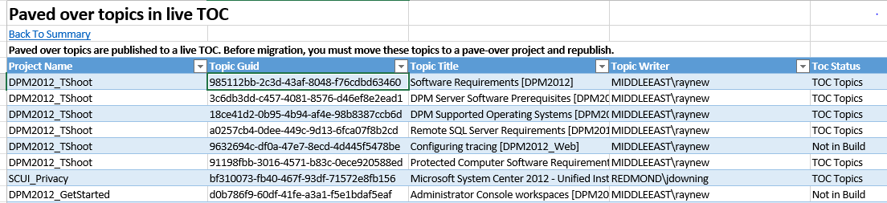
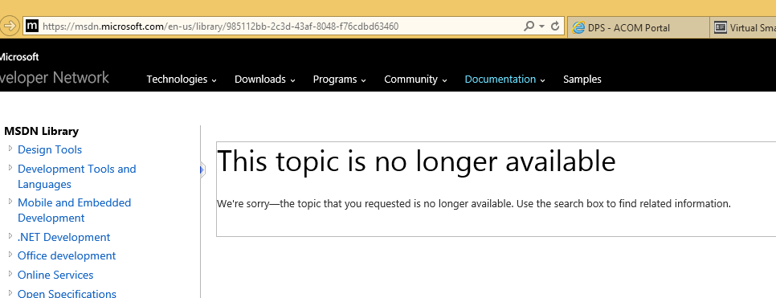

# P0 Paved over topics in live Table of Contents (TOC)
Paved over topics are published to a live TOC. Before migration, you must move these topics to a pave-over project and republish.

1. Open pre-migration report tab and copy GUID for error

	

1. Search for that topic in DxStudio. 

	*Tip: Use Ctrl G and paste the guid. *

	Example: 985112bb-2c3d-43af-8048-f76cdbd63460 in WEMDMAIN. In the report, this entire project is being flagged as being paved over, but published live. 
	
	To verify if this is true. Go to either Technet or MSDN and put the GUID in the URL. 
	
	
	
1. Is the topic shared? If yes, undo the sharing. (optional step, but recommended)
1. Drag the topic to the designated PaveOver project set up in your Db for the migration work. 

## How to: Create a PaveOver project (through PubDesk)
1. [File a request with PubDesk](http://vstfcsd:8080/tfs/CSI/Engineering/_workItems/create/Work%20Request?%5BCSI.Questions.RequestType%5D=Project+Setup+and+Build&%5BCSI.Questions.Task%5D=DxStudio+Administration)
1. Select the following options:
  * Request Type: Project Setup and Build
  * Task: DxStudio Administration
1. Provide the following in the Required Information tab:
  * Project name. For example, *Release*_Paveover. Note that project names have 21 char limit.
  * PF/PV for each project. The pv/pf must be set to match what topics were already published to or they won’t publish as delete to pave them over
   
To identify what pf/pv a topic was published to, right-click on the Publishing project and select History. On Metadata tab, look for publishing history (mtpslivehxs; add/update; en-us; *Azure.100*). The last part (italicized) will be the product family version.

## What is the role of a "PaveOver" project?
Pave-over topics get called out in the migration report for a number of reasons

1. After the topic was paved over the source was not properly relocated. Some writers move the topic to the deleted folder, others put the topic in the Not In Build folder while others get moved to a Pave-Over project. The issue for migration is that topics in the deleted folder as well as the NIB folder will NOT be migrated. In the Dx world there is an expectation that even though the topic is paved over, the source will still exist in case they need to go back to it someday. Since any topics in the deleted or NIB folders will not be migrated, they are called out in the migration report to raise awareness. To correct this the paved-over topic needs to be in the proper location (in the pave-over project for that content set and not in the deleted or NIB folders)
1. In CAPS there will be a Retired Content folder in each docset. During migration any paved-over topics included in the migrating content will be migrated to the retired content folder. In DxStudio there is one Pave-over project per database. It is possible that there will be multiple content sets within a database being migrated. In order to ensure that the migration process migrates paved over topics properly, it is a requirement that there be a pave-over project in Dx for each content set and that all paved-over topics within that content set are moved to that pave-over project (this is SQL14 project Nelly refers to below). This is so the migration project will know where to find those topics during migration. Part of the clean-up is to make sure those topics are in the proper project.
1. We have also encountered situations where topics were paved over improperly. Example: parent topic was paved over but children are still shared into the TOC as live topics and then parent topic just dropped in NIB folder. In this case the clean-up involves moving the children tot  anew source project, ensuring they are still shared properly, moving the paved over topic to the pave-over project and then republishing to ensure all the metadata is up to date prior to migration.