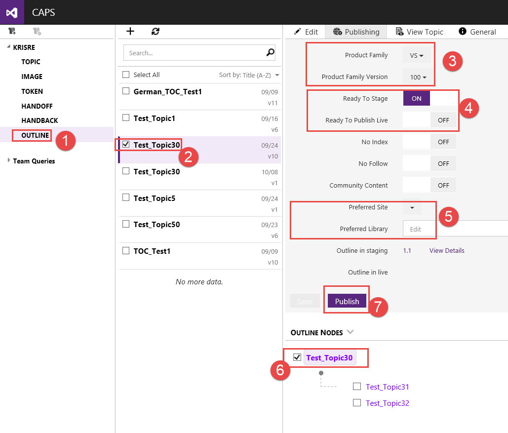
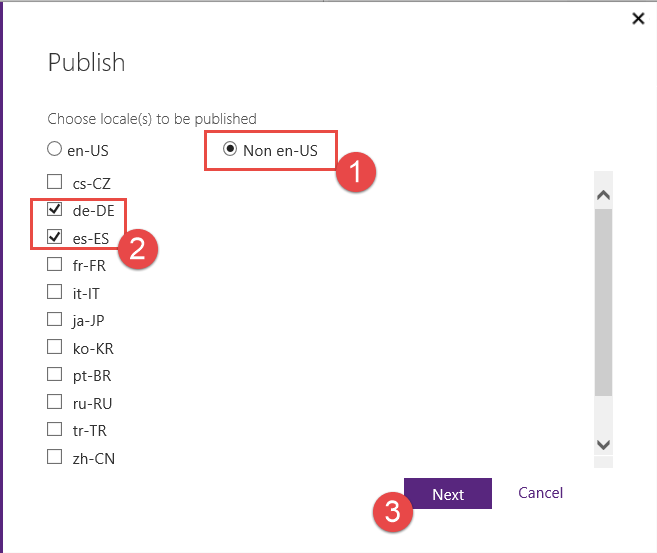
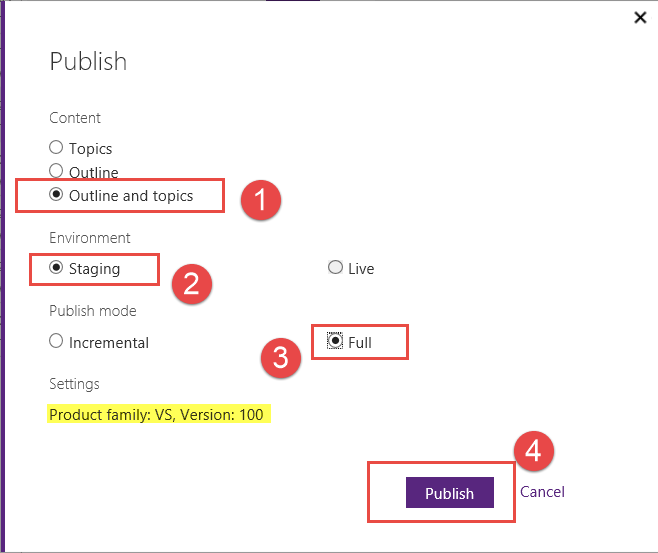
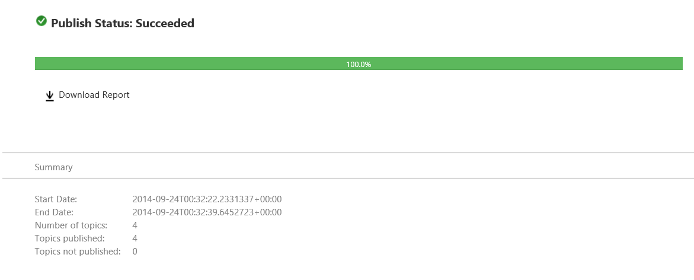

# Publishing localized topics
Publishing localized documentation starts from an existing English TOC Outline.

> [!IMPORTANT]
> The default language content (English) must already be published.

To publish localized content:

1.  Go to the **Outline** section.

2.  Select the Outline for which you want to publish localized content.

3.  Click on **Publishing** section.

4.  Make sure that **Product Family** and **Product Family Version** are set. The Product Family and Product Family Version should already be selected by the Core team.

5.  Make sure the Ready to Stage or Ready to Publish Live settings are correct.

6.  Make sure the Preferred Site and Preferred Library are set if needed.

7.  Select the top node, and only the top node, of the Outline.
    Then click on the **Publish** button.

    

Next, in the first **Publish** dialog box.

1.  Select the **Non en-US** radio button.

2.  Check the languages you want to publish.
    Then click on the **Next** button.

    

In the second **Publish** dialog box

1.  Select which content you want to publish.  The first time you are publishing a language select the **Outline and topics** option.

2.  Select the environment you want to publish to **Staging** or **Live**.

    > [!NOTE]
    > -   To publish content, the **Ready To Stage** or **Ready To Publish Live** flags must be set appropriately.
    > -   Content has always go to stage first in order to go live.

3.  The first time publishing a language select the **Full** option for **Publish mode**.

4.  Click on the **Publish** button to publish your translated content.

    

Publishing status

