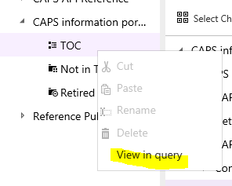
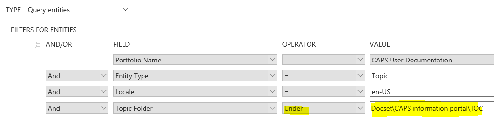
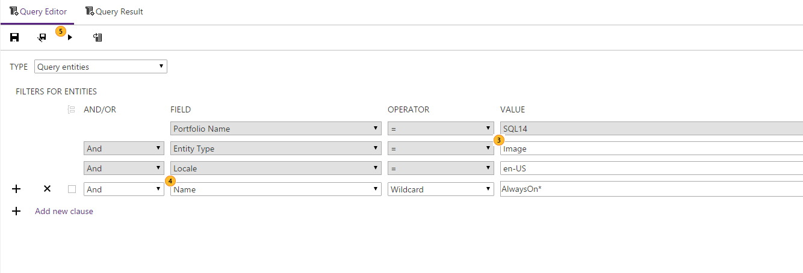

# Query Techniques and Examples
This topic covers the different types of content you can find in CAPS by using queries, as well as default queries, and query techniques such as using macros and using scoped queries.

## Default ("canned") queries
CAPS provides some of the most-used queries pre-populated for quick usage. These are sometimes call "canned queries". You can do further customization for them as you need. These are:

1.  **All My Art** - Returns  all the images that are either assigned to me or where I am the designer at the portfolio level.

2.  **All My  Checked out Topics** - Returns all the topics that I have checked out in a given docset.

3.  **All My Topics** - Returns all the topics in a given docset where I am the editor, the manager, the writer, or the topics are assigned to me.

4.  **English topics promoted in the last 7 days** - Returns  all the English topics that have been published to live in the last 7 days in a given docset.

5.  **Topics To Be Localized** - Returns all the English topics that are marked for human localization and have changed in the last 30 days.

6.  **Topics To Be Sent to Vendor Editors** - Returns all the English topics within a given docset marked for revision.

## Creating scoped queries using View in query
You can create a new scoped query from anywhere in the CAPS hierarchy by right-clicking an entity and selecting View in query. This creates a new query and adds an UNDER clause to return all the items under the selected entity. For example, selecting View in query on the TOC container of a docset...

...builds a query that returns all topics in the docset TOC:

You can use these queries as a starting point for more advanced queries.

## Finding dependencies
To use a dependency query to find which topics take a dependency on an entity:

1.  Create a new query.

2.  In the FILTER FOR DEPENDENCIES (primary) query, in the TYPE drop-down, select Query topics for dependencies.

3.  For the Entity Type clause, select the type of entity, such as Image.

4.  For Locale, select the locale, such as en-US.

5.  For GUID, paste the GUID of the entity you are interested in.

6.  If desired, you can scope the result using the secondary filter, FILTER FOR ENTITIES. For example, if you only want to know which Italian topics reference a particular image, you can add Locale = it-IT. Note that currently for new dependency queries, by default the secondary filter includes the GUID = clause with a null value; this means that you will not return any results unless you add a GUID (which is rare -- usually you will not know which GUID may reference an image) or delete the clause (this is usually what you will want to do).

For example, the following query finds all English topics that reference the image with GUID 4dad28a3-c841-44b4-8c7c-ce4e01720cee.

## Queries can use macro, i.e. @Me and @Today
All the user fields have a @me value to make easier to find topics or any other assets that you own.

All the date fields have a @today value to make easier to find topics or other assets based on a date. You can add other operators to this value, for example use "Published to Live Date &gt;= @Today-7" to find topics published in the last 7 days.

## Searching for  topics whose dependency has change but content has not

## Searching for token name or contents

## Searching by locale

## Searching for children under any parent node/folder

## Searching by publishing metadata

## Searching  by publishing the last errors and warnings per topic
See [Finding topics with publishing errors or warnings](../Topic/Finding-topics-with-publishing-errors-or-warnings.md).

## Searching for images by partial name
You can find images in a portfolio by doing a partial search on the image name, including a search on part of the word in the image name, using Advanced query.

|||
|-|-|
||In the upper left-hand corner of the CAPS window, click the **add** icon.|
||Click **New Query**.|
The query editor displays.

|||
|-|-|
||Select **Image** as the Entity Type.|
||Add a clause to search on Name, using the Wildcard operator. Enter the partial name of the image, using asterisk to indicate whether the beginning or end (or both) of the name is incomplete.  In the example shown in this image, the search is for an image name that begins with AlwaysOn.|
||Run the query.|
