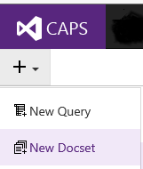
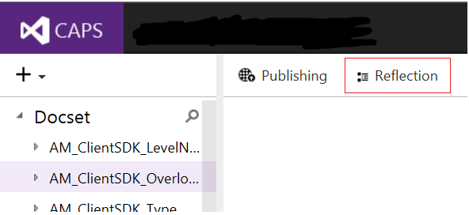
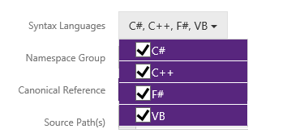

# Reflection and Comment Import
In CAPS, reflection and XML comment import  are configured and run at the same time.

## Prerequisites

-   You must have permissions to the CAPS environment you want to use (DevInt for testing, PROD for publishing content).

-   You must have the required DLLs and dependencies.

-   You can optionally provide an XML comment file.

-   DLLs, dependencies, and XML comment files must be hosted on a  network share that CAPS can access. CAPS cannot access files at a local path. Use a share with permissions set to Everyone, or provide perms to the appropriate CAPS environment: DevInt = redmond\vscbuild; PROD = fareast\capsblds.

## To set up a new reflection and comment import

1.  Post your DLLs, dependencies (if known), and XML comment files (if available) on a network share. In CAPS, you can point to a folder and specify all the DLLs at once, rather than adding each individually. Note that CAPS will take DLLs from all child folders, so be careful not to include, for example, dependency folders in your source folder, or you will reflect dependency DLLs as well.

2.  In CAPS, click to create a new Docset.

    

3.  Select the Mref template.

4.  Add a short but meaningful name for your reflection.

5.  Specify the topic aggregation level. None = every type and member has its own page; Overload = all overloads are on a single page; Type = each type, including all its members, is on a single page. If you have large types with many members and/or lots of content, Type-level aggregation may be unwieldy.

    > [!WARNING]
    > There is a bug in Overload level aggregation that causes all method and property pages to take the "Overload" prefix instead of "M:" or "P:" whether they are overloaded or not. This means the asset IDs are wrong when published and many links can be broken or wrong. DO NOT use Overload level aggregation until further notice.

6.  Click OK. A new empty mref docset will appear in the Docset list.

7.  Select the new docset and click the Reflection tab.

    

8.  Choose the syntax languages from the drop-down. Every topic in the docset will show syntax in the selected languages.

    

9. Select whether to group namespaces. Namespace grouping adds an intermediate level -- e.g., all namespaces beginning with "Microsoft.SqlServer" are grouped. Grouping is only recommended for very large projects.

10. Select Canonical Reference = True or False. IsCanonical is a new attribute that applies to the entire mref docset and supports situations where multiple docsets contain the same namespace. The canonical docset builds and publishes API topics using the fully-qualified name. Non-canonical docsets will build using a numeric ID. This will allow us to publish duplicate namespaces without Product Family Version hacks.

11. Add the source DLL path(s).

    > [!NOTE]
    > At this point it is highly recommended that you save and validate reflection to learn what dependencies are required.  CAPS uses a global dependencies cache to store common dependencies for reuse. As the cache gets populated from more and more reflections, fewer dependencies will be required for most reflections. Hunting for dependencies can be time consuming, and pointing  to a large build share to try to find all the dependencies reduces performance and can even time out if the folder is too large, so you should only specify the dependencies you actually need! If you do specify dependencies, make it easier for the next person by filing a PubDesk ticket requesting that the dependencies be uploaded to the global cache.

12. Add the dependency path(s) if required, and XML comment path(s) if available.

13. Optionally, specify whether to Overwrite All Comments. For new reflections, this value doesn't make a difference -- it only comes into play when comments are updated (see below).

14. Save and validate (again).

15. Correct any validation issues and save again.

16. Click Run.

## To update DLLs and/or XML comments

1.  Replace the files on your existing share, OR update the paths on the  Reflection  tab.

2.  If you are updating XML comments, specify whether to Overwrite All Comments. 

      TRUE = XML comment file overwrites the CAPS content. 
      >[!WARNING] As of 2/10/16 this means that blank fields in XML overwrite content in CAPS; a request ([24366](https://capservice.visualstudio.com/DefaultCollection/CAPS/_workitems?id=24366&fullScreen=false&_a=edit)) has been made to change the behavior but be aware that currently this option will remove all existing content.
      
      FALSE (the default) = CAPS wins;  that is, if Overwrite All = FALSE, new comments are imported only where no content previously existed OR where content has never been edited in CAPS. Note that this behavior is a little different from SlamDunk in DxStudio, where New Only means updated comments will never overwrite previously imported content, even if it has never been touched by writer in DxStudio. This is by design, to enable product teams to continuously improve their content in the increasingly common scenario where writers are doing little or no mref authoring. This should work based on topic history even for content migrated from DxStudio -- but please request help with a test import if you have not done this before.

3.  Save, Validate, and Run reflection.

4.  You can use a query to identify topics that were added or updated by reflection. See "Updated By Reflection" in [MRef Queries](https://sandboxmsdnstage.redmond.corp.microsoft.com/en-US/library/mt278490.aspx) for more information. Note that CAPS does not include icons in the TOC to identify new APIs.

5.  APIs that have been removed from the DLLs since the last reflection will be added to the Retired Contents folder for the docset:

    

    From there, they can be paved over just like conceptual topics. See [enter link description here](Retiring-Content--AKA-Paving-over-.md)

## Auto-updating ("tokenized") reflection
You can point reflection at a build share and specify to always get the latest DLLs and XML files. To do this:

1.  Ensure that you have obtained permissions to the build share for the appropriate CAPS alias (DevInt = redmond\vscbuild; PROD = fareast\capsblds).

2.  Get the URL for the level of the share just above the individual build folders, such as \\share\tfs\Product\Main.

3.  Open to see the build version number pattern, such as:

    

4.  Continue to drill down to find the source DLLs in the latest build. For example, \\share\tfs\Product\Main\20140630.1\x86\Release\Microsoft.Example1.dll.

5.  Add the source DLL paths, substituting the build version numbers with tokens that match the pattern. The token syntax is % followed by one # for each  place, period-delimited as appropriate, ending in another %. For example,  20140630.1 becomes %#.#%.   You will generally need to provide the path for each source DLL individually, because the build folder will probably include other DLLs and/or sub-folders you do not want to reflect. Using the current example, your paths would look like this: \\share\tfs\Product\Main\%#.#%\x86\Release\Microsoft.Example1.dll, \\share\tfs\Product\Main\%#.#%\x86\Release\Microsoft.Example2.dll, etc.

6.  To enable automatic comment update, add the XML comment paths in the same way.

7.  Add the dependency paths. These paths can be tokenized or static, depending on how much churn you expect.

8.  Set the desired recurrence pattern (see below).

## Recurrence
You can set up recurring reflection on either static or tokenized reflection (you should only do the former if files are being actively updated on your share, e.g. if you have arranged to have your product team drop updated DLLs and/or XML comment files to the share throughout the product cycle).

1.  Click the Recurrence button.

2.  Select Enable Recurrence = True then fill in the other options. (Please don't select every minute or every hour. It's not necessary. You know it's not.)

    

