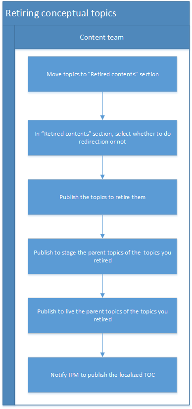

# Retiring Conceptual Topics
This workflow assumes that the content has been published already. Otherwise, when attempting to retire, CAPS will return an error message in the publishing report indicating that the topic was not published, hence, cannot be retired. In that case, you can simply delete the topic from the CMS if you would like. 

