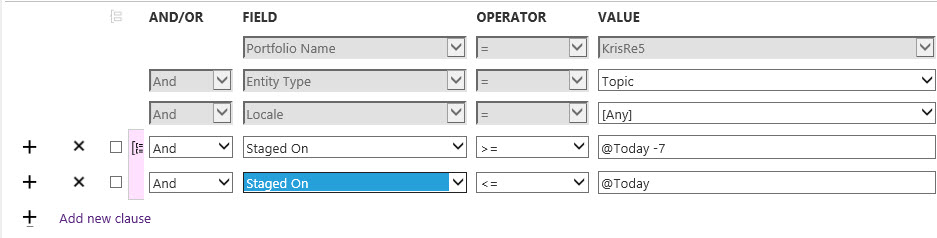
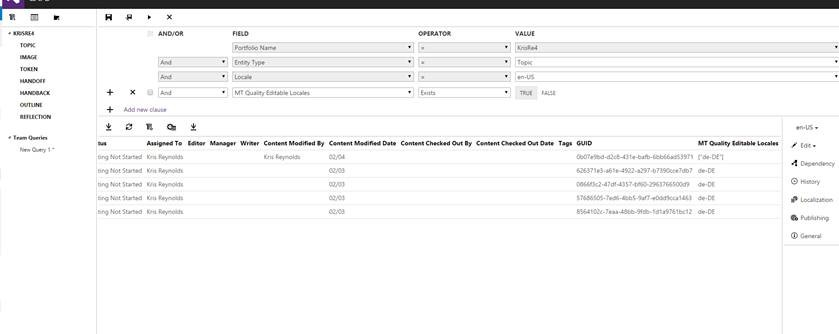
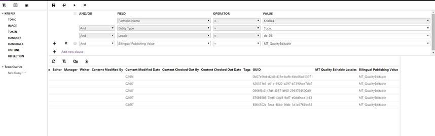

# Sample Queries for Localization
Insert introduction here.

## Useful Queries for Localization
A collection of CAPS queries that IPMs and other users of localized content may find useful.

## Loc Publishing Queries
What  localized topics did I publish to Stage last week?

Use the "Live On" field to see what was promoted to the Live server.

## Bilingual Pub Settings Queries
Which locales have topics set to Bilingual: Edit Human Translation ( MT_Type=QualityEditable)?

This metadata field applies to the en-US article only.  To see the locales add the Bilingual: Edit Human Translation (MT Quality Editable Locales) in query results through the column selector feature.

For a specific  locale which topics are set to Bilingual: Edit Human Translation ( MT_Type=QualityEditable)?

This metadata field applies to the localized article only.  To see the Bilingual Publishing Value in the query results add it through the column selector feature.

