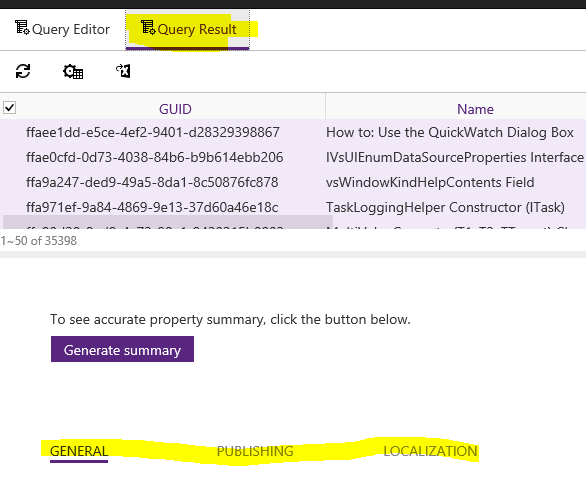

# Setting Metadata
Most metadata can be set via the CAPS UI by selecting or authoring values on the following tabs:

* Docset-level General tab
* Docset-level Publishing tab
* Reflection tab (MRef docset-level only)
* Topic-level General tab
* Topic-level Publishing tab
* Localization tab (topic-level only)

For a list of attributes, what they mean, and how to set them, see [Topic Metadata](https://sandboxmsdnstage.redmond.corp.microsoft.com/en-us/library/dn942344.aspx).

In general, it's pretty straighforward: docset-level attributes apply to every topic in a docset, while topic-level attributes can bet set individually.

To set topic-level attributes in bulk:
1. Select the topics you want to set. You can do this within a docset by control clicking multiple topics or using Select Child Nodes:

	

	... or you can do it on the results of a query:

	

2. Select the appropriate tab. If you are applying attributes on the esults of a query, make sure you're on the Query Result pane, not the Query Editor:

	

3. On the selected tab, you will see all the metadata fields you can edit in bulk for that tab. Assign the desired value(s) just as you woud for an individual topic. For example, to set the manager for a selected group of topics:

