# Setting up XMetaL 9.0
**In this topic**

-   [CAPS authoring toolbar](#bkmk_toolbar)

-   [Showing Tags on while editing](#bkmk_tagsonview)

-   [Displaying the Elements and Attributes](#bkmk_displayelementsattributes)

-   [Showing the Table toolbar](#bkmk_tabletoolbar)

-   [Hiding toolbars or menu elements that do not work with CAPS documentation](#bkmk_hiddingtoolbars)

## CAPS authoring toolbar
After you install the add-in, there should be a CAPS toolbar showing in XMetaL. In the event that does not show, please right click on the toolbar area and enable the CAPS toolbar.

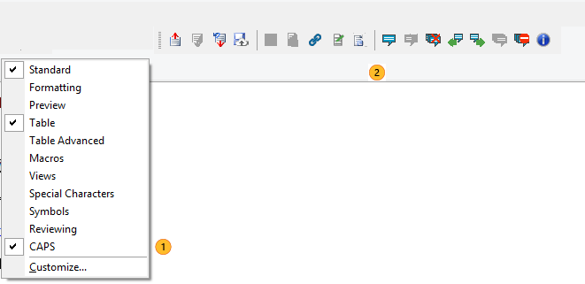

The CAPS toolbar allows you to do the following:

|Icon|Meaning|Shortcut key|
|--------|-----------|----------------|
|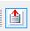|Check-in a topic|Ctrl+Alt+I|
|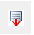|Check out a topic|Ctrl+Alt+O|
|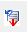|Undo check out a topic|Ctrl+Alt+U|
|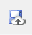|Save a draft of your topic in the server|Ctrl+Alt+S|
|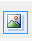|Insert an image|Ctrl+Alt+A|
|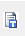|Insert a token|Ctrl+Alt+T|
|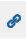|Insert a link (internal or external to CAPS)|Ctrl+Alt+L|
|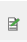|Insert Common Text|Ctrl+Alt+C|
|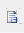|Insert an element|Ctrl+Q|
||Insert  a review comment|Ctrl+Alt+N|
|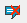|Delete a review comment|Ctrl+Alt+D|
||Delete all review comments|Ctrl+Alt+R|
||Go to the previous review comment|Ctrl+Alt+P|
|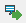|Go to the next review comment|Ctrl+Alt+X|
||Show all review comments|Ctrl+Alt+S|
||Hide all review comments|Ctrl+Alt+H|
||Show the version of the CAPS authoring toolbar|Ctrl+Alt+A|

## Customizing the XMetaL editor
The following sections show some customization to the XMetaL environment that you can do to hide elements that do not work with CAPS documentation so your environment is not cluttered, or show useful components that can help you speed your job.

It is not possible for the engineering team for the  plugin to control  XMetaL toolbar.

### Showing Tags on while editing
By default, the first time you install XMetaL, you will get a view without the tags. In order to see the tags each time you open a document, follow these steps:

1.  Go to **Tools - Options**.

2.  On the **View** tab, select **Tags on View**.

3.  Click **OK**.

### Displaying the Elements and Attributes
By default, the elements and their attributes are not displayed. Follow these steps to see them:

1.  Go to **View - Element List**. You will see the Element List pane on your right.

2.  Go to **View - Attribute Inspector.** You will see the Attribute Inspector pane on your right.

### Showing the Table toolbar
You can use the XMetaL Table toolbar in order to help you inserting rows, cells, etc.

Right-click on the toolbar are and click **Table**.

### Hiding toolbars or menu elements  that do not work with CAPS documentation
We recommend you keep your environment simple to just the elements you can use when authoring CAPS documentation. Here are some examples.

Formatting toolbar  - Right-click on the toolbar section and hide **Formatting**.

