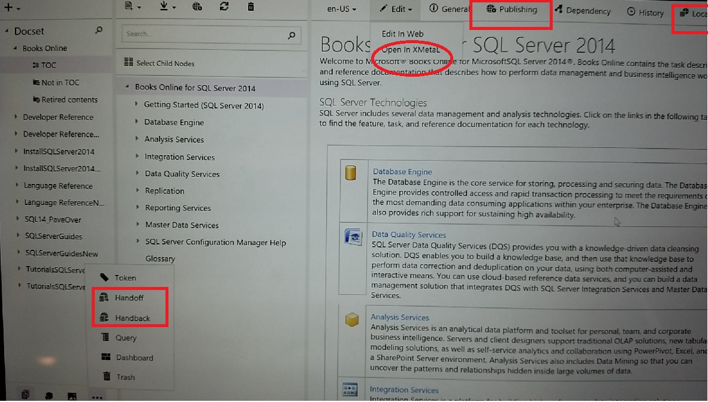

# Support Handbook for Tier 1

This is a live document we are using CAPS Markdown Editor(online) to maintain and keep it up to date. Please refer to below Markdown resources on details of the flavor of Markdown syntax.  

*View the [Markdown Basics](https://help.github.com/articles/markdown-basics/)* 
*View the [Github Flavored Markdown](https://help.github.com/articles/github-flavored-markdown/)* 
*View the [Online sample](http://github.github.com/github-flavored-markdown/sample_content.html).* 
  
 
When a new issue is raised 
---
1.	**Production issue or not**. If the issue is NOT for production, ask the customer to log a bug in TFS instead of an issue(different type). Stop here. 
2. **Is this a known issue?** Check if the issue has been reported in TFS. If so, send email to customer about the known issue together with any workaround or fix.
3. **Repro the issue**. Try to follow the steps in the TFS bug to repro the issue in PROD. Note that when the repro step is about publishing to LIVE instead of staging, please try staging please. If we need to try live, please ping the customer FIRST. *publishing to live could lead to other issues w/o notifying customer.* If you repro the issue, move on. Otherwise, find a second person to try out. If still not repro it, send email to the customer to ask for more clear steps.
4. **Determine the priority**. There are 4 priorities, 1 thru 4. There is no P0 for now in the TFS. In case of a real P0 issue, the customer will send us an email to raise the priority. Based on the SLA definition of LSI in the sibling node, you may need to re-assess the priority before taking any further actions as below.
5. **Is it really CAPS issue?** please isolate the issue from Azure, networking, even MTPS. If it is MTPS related issue, CAPS publishing is impacted(so is other client liek DXStudio).
6. **Is it general issue or individual writer or individual profolio issue?** asking another person to repro, or check existing active issue, or ping someone for confirmation are some ways to determine that.
7. **Determine the feature team**. Below table helps to find right engineering team, then loop up 
the right team at [ICM](https://icm.ad.msft.net/imp/CurrentOnCall.aspx?teamId=23146&tenantId=20342&incdep=0&incvirt=1&mode=oneshift) for right DRI. If there is no rotation for a given team, always use Engineering Manager for the team.
 

Areas  | Engineering Team | Its Manager | Cell phone  
---------|---------
Preview, Build & Publishing    |   CAPS Build |Ken Chen| +86 1381 876 8875   
UI or Client, ToC, Query    | CAPS CLient|Su Shi|  +86 1381 622 9478      
Xmetal, Markdown Editor     |   CAPS Xmetal|Xinyi Zhang| +86 1391 721 6696
Localization, Handoff & Handback|CAPS Localization|Zhen Jiao|+86 1360 180 1293
Migration|CAPS Migration|Zhen Jiao| +86 1360 180 1293    
 

 

8. **Actions** as below. 

Priority  |Steps  
---------|---------
P0     |    Escalate to Tier 2(Sandesh, GW/Sandra Aldana Abad (saldana@microsoft.com) intermediately and start an email thread on the issue. ALso send notification to capsinfo alias. Prepare for a bridge     
P1    | Before 4PM PST time, send email to recognize it, and ping GW/Sandra Aldana Abad (saldana@microsoft.com). After 4PM PST time, ping the feature team DRI. Use bridge call if necessary.         
P2     |  after determine it is a feature team issue, send email to them ccing vscops.       
P3/P4 | Same as P2.

9. **Follow up with issue**. based on the timeline in SLA, make sure to either resolve the issue on time, or close it by having feature team to create another bug.