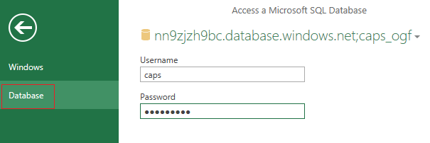
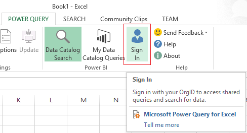

# Undocumented API and OGF Reports
For undocumented API reporting in CAPS, we use Excel and Power Query.

This report is provided to help identify API topics in CAPS that do not meet at least "Fair-level" documentation. "Fair" is the minimum-compliant level on the Outstanding-Good-Fair scale defined by Microsoft to rate API documentation completeness. "Fair" requires each type and member topic to have a summary and descriptions for all parameters and return values. Note that the report runs against managed reference content in CAPS; therefore, it will NOT identify APIs that should be documented but have not been reflected in CAPS. It is the responsibility of writers to work with their product teams to identify which DLLs need to be reflected and documented.

The purpose of this topic is to provide instructions for using the CAPS Undocumented API and OGF reports. A full discussion of Microsoft compliance policies is out of scope, but please consult your compliance team or LCA if you have questions. And see the [FAQ below](#What-is-APIScan) if you're confused about the difference between this report and APIScan.

## Permissions
Everyone on the csifte alias already has perms. If you are a not on this alias and need to use the tool, contact MBradley.

## Instructions for Excel 2016
1. Open Excel and create a new worksheet.
2. On the Data tab, click **New Query**, then select **Data Catalog Search**.
3. If prompted, enter your corpnet ID.
4. Under Data Catalog Search, search for "undocumented" - you should see "Undocumented API Report" and "Undocumented API Report (All)".
5. For Fair-level verification, select "Undocumented API Report", then select Load.
6. When prompted for authentication, choose Database authentication, and specify username=**undocuser**, password=**#Bugsfor$**. Click Connect.

   

8. If prompted, click OK to use unencrypted connection.
8. This query will return a spreadsheet of all CSI mref in CAPS that does not meet minimum Fair-level requirements (that is, summary, parameter, and/or return value descriptions are missing). 
8. Use Excel filtering to scope your results. You can also delete columns, etc., to make the data easier to use, but note that these changes will not persist when the query is refreshed.

### To view/edit topics in CAPS
1. Scroll to find the Edit column.
2. Open the link (you may need to double-click first to activate the hyperlink).
3. This will take you to the topic in CAPS!

### Interpreting results
The report includes columns for the various Fair-level elements that _might_ be required for an API. But not all APIs have all the elements; for example, every API requires a summary, but an API might not have a return value, a parameter, or a type parameter. The logic for reporting is as follows:
* If a field is expected and present, **Present**.
* If a field is expected but missing, **Missing**.
* If a field is not expected and not present, **NotApplicable**.
* If a field is not expected but present, **ExtraDoc**. This can happen because of a bug in CAPS ([24753](https://capservice.visualstudio.com/DefaultCollection/CAPS/_workItems?searchText=reflection&_a=edit&id=24753&triage=true)) where syntax elements removed from the DLL were not removed from the topics upon reflection update. The bug is fixed as of sprint 98 (deployed 4/5/16), so subsequent reflections should not have this issue. If you find **ExtraDoc** hits for existing content, you can either re-run reflection or remove them manually (if you have a small number and do not want to re-run reflection), and then re-publish.

### To exclude a result
1. Scroll to the Exclude column at the far right.
2. Open the link.
3. Check the Exclude box, select the exclusion reason, and click save.
4. When you refresh the query, the row will show as excluded.
5. If appropriate, you can later unexclude.

## Instructions for Excel 2013
1. Download and install [Power Query for Excel](http://www.microsoft.com/en-us/download/confirmation.aspx?id=39379) if you haven't already. 
2. Open Excel and create a new worksheet.
4. On the POWER QUERY tab, log in with your org ID.

   
5. Search for "undocumented" - you should see "Undocumented API Report" and "Undocumented API Report (All)"
6. In the results, under ORGANIZATION, select Undocumented API Report and open the query.
7. The rest of the steps are the same as Excel 2016.

## O-G-F Reporting
To see OGF information for all APIs, including excluded APIs and APIs that are not missing Fair-level content, use the "Undocumented API Report (All)" query instead of "Undocumented API Report".

## FAQ

### Who owns the report?
The report is maintained by the Thai team. Megan is the PM. For the time being, please report bugs and feature requests to Megan (mbradley) as we do not yet have a triage process set up.

### How often is the report updated?
The report runs every six hours on all topics that have been modified since the last run. However, note that the report feeds data from Data Hub, not CAPS directly. The Data hub is not updated real-time, so it may be delayed up to 1–2 days. 

### What is APIScan?
The Undocumented API report is not the same as APIScan. APIScan is a tool run by product teams on their source code to identify calls to undocumented APIs in other products. For example, the SQL team runs APIScan on shipping binaries to make sure they aren't calling undocumented APIs in Windows or Office, which would be serious compliance violation. You might occasionally get a bang email from another team saying you have to document an API because it's showing up in an APIScan report. Take this seriously, but please be aware that you would generally not catch this kind of issue with the Undocumented API report because the report only runs on topics that have already been reflected into CAPS. You should communicate with your product team to ensure that you are reflecting all the DLLs that might be called by internal or external customers.

For more information about APIScan, see the [APIScan wiki](https://microsoft.sharepoint.com/teams/apiscan/APIScan%20User%20Wiki/apiscan_overview.aspx).
