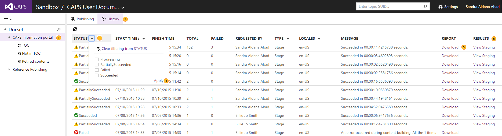

# Viewing publishing history

1. Go to the Docset.
2. Click on **History**
3. To filter by any of the fiels, click on the arrow and select one or more of the available options. Note that you can filter by more than one field at a time.
4. Click on **Apply**.
5. To see the publishing report, click on Download
6. To go to the published page, the reflection, or the offline file, click on the link under **RESULTS**.
