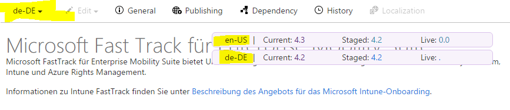

# Viewing the Staged and Live Versions of a Topic
You can see the current (in CAPS), staged, and live versions of a CAPS topic in the pink bar in the topic in preview.

The number before the dot is the version of the content blob of the topic (that is, the body text). The number after the dot is the version of the metadata. The metadata version only increments for changes that affect localization; for example, changes to titles and keywords increment the version because they need to be localized, but changes to writer, editor etc. do not. This is to avoid unnecessary Loc handoffs.

For localized topics, there are two pink bars, one showing the versions for the current locale and one showing the versions for English. This shows the delta between Loc and English, if any.

The staged and live versions are live links, so you can click through to see the topic published to staged or live.

In the following example, the English content version in CAPS is 4. This version has been staged but not published live, and has had one metadata update since it was staged. The German version in CAPS is the same as the staged English version, meaning that the last metadata update has not yet been localized.

An asterisk after a version number indicates that that publishing job succeeded with a warning. You can check the publishing log from the History tab for details.
