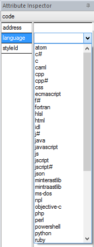
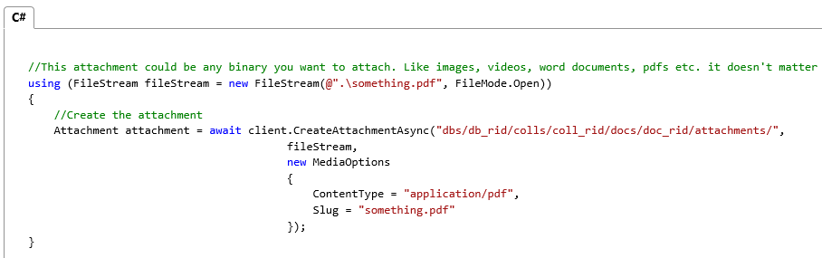
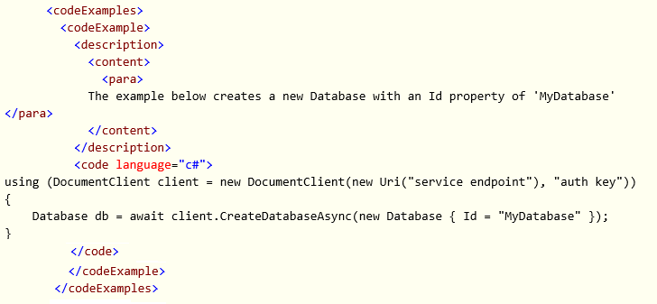
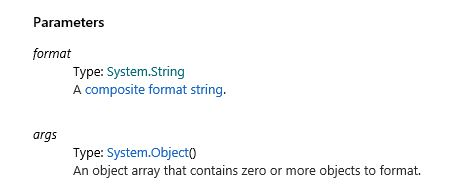

# XML Comment Guidelines
CAPS supports all of the C#  Programming Guide's[Recommended Tags for Documentation Comments](https://msdn.microsoft.com/en-us/library/5ast78ax.aspx), except &lt;include&gt;. Note that this section provides supplementary information about writing XML comments for import into CAPS; it does not attempt to duplicate the C# Programming Guide.  For general information about writing triple slash comments, see that guide.

If you have questions about XML comments or run into any trouble, please email mbradley for assistance.

## Notes for writing XML comments for CAPS

||||
|-|-|-|
|[&lt;a&gt;](#aTag)|[&lt;para&gt;](#paraTag)|[&lt;see&gt;](#seeTag)|
|[&lt;c&gt;](#cTag)|[&lt;param&gt;](#paramTag)|[&lt;seealso&gt;](#seealsotag)|
|[&lt;code&gt;](#codeBlockTag)|[&lt;paramref&gt;](#paramrefTag)|[&lt;summary&gt;](#summaryTag)|
|[&lt;example&gt;](#exampleTag)|[&lt;permission&gt;](#permissionTag)|[&lt;typeparam&gt;](#typeparamTag)|
|[&lt;exception&gt;](#exceptionTag)|[&lt;remarks&gt;](#remarksTag)|[&lt;typeparamref&gt;](#typeparamrefTag)|
|[&lt;list&gt;](#listTag)|[&lt;returns&gt;](#returnsTag)|[&lt;value&gt;](#valueTag)|

## <a name="aTag"></a>&lt;a&gt;
The &lt;a&gt; element is not supported. Use [&lt;see&gt;](#seeTag) for linking.

## <a name="cTag"></a>&lt;c&gt;
Use to style text as code inline within a sentence. See [<c>](https://msdn.microsoft.com/en-us/library/te6h7cxs.aspx) in the C# Programming Guide.

## <a name="codeBlockTag"></a>&lt;code&gt;
Use to add a code block. See [<code>](https://msdn.microsoft.com/en-us/library/f8hahtxf.aspx) in the C# Programming Guide.

To take advantage of language-specific code styling in CAPS, you must add the language attribute in the code tag. Available values are as follows:



Note that values are case-sensitive (all lowercase). Here's an example &lt;code&gt; tag from an XML comment file:

```
<code language="c#">
//This attachment could be any binary you want to attach. Like images, videos, word documents, pdfs etc. it doesn't matter
using (FileStream fileStream = new FileStream(@".\something.pdf", FileMode.Open))
{
    //Create the attachment
    Attachment attachment = await client.CreateAttachmentAsync("dbs/db_rid/colls/coll_rid/docs/doc_rid/attachments/", 
                                        fileStream, 
                                        new MediaOptions 
                                        { 
                                            ContentType = "application/pdf", 
                                            Slug = "something.pdf" 
                                        });
}
</code>
```
This is what it looks like on MSDN:



Without the language attribute, it would look plain, like the content from the XML comment file example above.

## <a name="exampleTag"></a>&lt;example&gt;
See [<example>](https://msdn.microsoft.com/en-us/library/9w4cf933.aspx) in the C# Programming Guide.

On import to DDUEML, &lt;example&gt; elements are converted to &lt;codeExample&gt; and placed within a &lt;codeExamples&gt; element. Inside &lt;codeExample&gt; you will have a &lt;description&gt; element  and one or more &lt;code&gt; elements.   If you include text immediately under &lt;example&gt;, it will be added under &lt;description&gt;&lt;content&gt;, as follows:

```
<example> The example below creates a new Database with an Id property of 'MyDatabase'
<code language="c#">
<![CDATA[
using (DocumentClient client = new DocumentClient(new Uri("service endpoint"), "auth key"))
{
    Database db = await client.CreateDatabaseAsync(new Database { Id = "MyDatabase" });
}
]]>
</code>
</example>
```
...becomes:



Note that DDUEML does not allow additional &lt;description&gt; elements, and &lt;para&gt; and other elements between &lt;code&gt; elements will not be imported. If you want to add multiple examples with descriptive text before each, you must add multiple &lt;example&gt; tags, like this:

```
<example>
         The example below creates a new Database with an Id property of 'MyDatabase'
<code language="c#">
<![CDATA[
using (DocumentClient client = new DocumentClient(new Uri("service endpoint"), "auth key"))
{
    Database db = await client.CreateDatabaseAsync(new Database { Id = "MyDatabase" });
}
]]>
</code>
 </example>
 <example>
The example below creates a collection within this database of the S3 offer type.

<code language="c#">
<![CDATA[
DocumentCollection coll = await client.CreateDocumentCollectionAsync(db.SelfLink,
    new DocumentCollection { Id = "MyCollection" }, 
    new RequestOptions { OfferType = "S3"} );
]]>
</code>
 </example>
```
These will be converted to multiple &lt;codeExample&gt; elements, each with its own &lt;description&gt;&lt;content&gt;&lt;para&gt;.

Another issue to be aware of with &lt;example&gt; tags is that CAPS currently uses actual indentation for code, rather than relative indentation, so you need to start your code blocks at the far left to avoid excessive indentation. There is [a bug open](https://capservice.visualstudio.com/DefaultCollection/CAPS/_workitems) to fix this, but please check the status of the bug before authoring your comments and author accordingly.

## <a name="exceptionTag"></a>&lt;exception&gt;
See [<exception>](https://msdn.microsoft.com/en-us/library/w1htk11d.aspx) in the C# Programming Guide.

Exceptions will be built into a table in CAPS.

## <a name="listTag"></a>&lt;list&gt;
See [<list>](https://msdn.microsoft.com/en-us/library/y3ww3c7e.aspx) in the C# Programming Guide.

Lists  cannot be used within &lt;summary&gt; in CAPS; this is invalid according to the DDUE schema.

## <a name="paraTag"></a>&lt;para&gt;
See [<para>](https://msdn.microsoft.com/en-us/library/x640hcd2.aspx) in the C# Programming Guide.

You do not have to add a &lt;para&gt; in every &lt;summary&gt;, &lt;remarks&gt;, etc. Plain text is valid. Only add &lt;para&gt; tags when you want more than one paragraph.

## <a name="paramTag"></a>&lt;param&gt;
Used to describe a parameter. See [<param>](https://msdn.microsoft.com/en-us/library/8cw818w8.aspx) in the C# Programming Guide.

CAPS auto-generates the parameter data type, so don't write descriptions like "A string." Instead, provide a meaningful description:



All parameters for public APIs in high-volume products must be documented to meet compliance obligations.

## <a name="paramrefTag"></a>&lt;paramref&gt;
Used to refer to a parameter in text, for example in &lt;remarks&gt;. See [<paramref>](https://msdn.microsoft.com/en-us/library/wb7x2fhw.aspx) in the C# Programming Guide.

Text in the name attribute on a &lt;paramref&gt; builds as italic in CAPS, like *this*. Note that &lt;paramref&gt; does not create a link.

## <a name="permissionTag"></a>&lt;permission&gt;
See [<permission>](https://msdn.microsoft.com/en-us/library/h9df2kfb.aspx) in the C# Programming Guide.

Importing &lt;permission&gt; tags is not currently working in CAPS. There is a bug in the CAPS backlog, but it has not been prioritized due to low demand. If you want to use the &lt;permission&gt; tag, contact  mbradley.

## <a name="remarksTag"></a>&lt;remarks&gt;
See [<remarks>](https://msdn.microsoft.com/en-us/library/3zw4z1ys.aspx) in the C# Programming Guide.

Do not use &lt;remarks&gt; for enumeration members. CAPS aggregates all enum members into a table in a single topic. If you add &lt;remarks&gt; at the member level, they will be lost on import into CAPS. Instead, add additional content to the member &lt;summary&gt;. This will go into the description for the member in the member table.

## <a name="returnsTag"></a>&lt;returns&gt;
See [<returns>](https://msdn.microsoft.com/en-us/library/3zw4z1ys.aspx) in the C# Programming Guide.

CAPS auto-generates the data type for return values, so don't write descriptions such as "Returns a string."

All return values for public APIs in high-volume products must be documented to meet compliance obligations.

## <a name="seeTag"></a>&lt;see&gt;
Use to add links inline within text. See [<see>](https://msdn.microsoft.com/en-us/library/acd0tfbe.aspx) in the C# Programming Guide.

CAPS supports the cref and href attributes on &lt;see&gt;.

To link to  another API, use cref and the fully-qualified name. These links will work if the other API is in the same docset of the current API, in another docset in the same CAPS portfolio, or in the global assembly cache. Links to new or uncommon APIs that are not documented in the same CAPS portfolio may be broken. If this is the case you can use an external link, or talk to your content team about other options.

To link to external pages, use the href attribute with the page URL as its value.

## <a name="seealsotag"></a>&lt;seealso&gt;
See [<seealso>](https://msdn.microsoft.com/en-us/library/xhd7ehkk.aspx) in the C# Programming Guide.

Adds a link to the See Also section at the end of the mref topic. Don't add &lt;seealso&gt; links inline in text; this will result in content gaps. For inline links, use &lt;see&gt;.

## <a name="summaryTag"></a>&lt;summary&gt;
See [<summary>](https://msdn.microsoft.com/en-us/library/2d6dt3kf.aspx) in the C# Programming Guide.

All public APIs in high-volume products must be documented with a summary to meet compliance obligations.

## <a name="typeparamTag"></a>&lt;typeparam&gt;
Used to document a generic parameter. See [<typeparam>](https://msdn.microsoft.com/en-us/library/ms173191.aspx) in the C# Programming guide.

All generic parameters for public APIs in high-volume products must be documented to meet compliance obligations.

## <a name="typeparamrefTag"></a>&lt;typeparamref&gt;
Used to indicate a generic parameter. See [<typeparamref>](https://msdn.microsoft.com/en-us/library/ms173192.aspx) in the C# Programming Guide.

Text in the name attribute on a &lt;typeparamref&gt; builds as italic in CAPS, like *this*. Note that &lt;typeparamref&gt; does not create a link.

## <a name="valueTag"></a>&lt;value&gt;
Used to document a property value. See [<value>](https://msdn.microsoft.com/en-us/library/azda5z79.aspx) In the C# Programming Guide.

All generic parameters for public APIs in high-volume products must be documented to meet compliance obligations.

